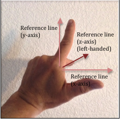
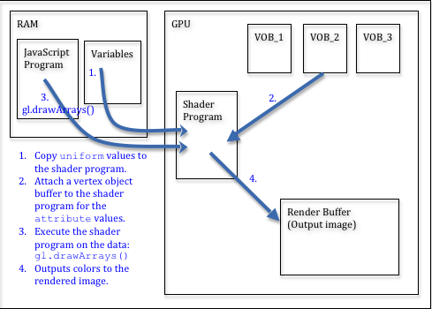

# 学习webGL

##### 学习的主要两个教程：

- https://webglfundamentals.org/
- http://learnwebgl.brown37.net/

在学习的过程中，可能经常在两个教程中跳跃。

每日总结中会有章节链接至对应的教程页面。

可能会出现重复的学习内容标题。

##### 相关链接：

> http://learnwebgl.brown37.net/
>
> https://webglfundamentals.org/webgl/lessons/zh_cn/
>
> https://developer.mozilla.org/zh-CN/docs/Web/API/WebGL_API/Tutorial


# 学习记录


## 2021.10.11


### webGL的书写方法[^1.1]

webGL的书写方法使用的下面的形式，而不是第二种形式

```
var centerX;
var centerY;
var radius;
var color;
 
function setCenter(x, y) {
   centerX = x;
   centerY = y;
}
 
function setRadius(r) {
   radius = r;
}
 
function setColor(c) {
   color = c;
}
 
function drawCircle() {
   ...
}
```

第二种形式

```
function drawCircle(centerX, centerY, radius, color) { ... }
```


### WebGL应用基本都遵循以下结构[^1.1]

初始化阶段

- 创建所有着色器和程序并寻找参数位置
- 创建缓冲并上传顶点数据
- 创建纹理并上传纹理数据

渲染阶段

- 清空并设置视图和其他全局状态（开启深度检测，剔除等等）
- 对于想要绘制的每个物体
  - 调用 `gl.useProgram` 使用需要的程序
  - 设置物体的属性变量
    - 为每个属性调用 `gl.bindBuffer`, `gl.vertexAttribPointer`, `gl.enableVertexAttribArray`
  - 设置物体的全局变量
    - 为每个全局变量调用 `gl.uniformXXX`
    - 调用 `gl.activeTexture` 和 `gl.bindTexture` 设置纹理到纹理单元
  - 调用 `gl.drawArrays` 或 `gl.drawElements`

基本上就是这些，详细情况取决于你的实际目的和代码组织情况。基本上就是这些，详细情况取决于你的实际目的和代码组织情况。


### 相关链接

[^1.1]: webGL 绘制多个物体：https://webglfundamentals.org/webgl/lessons/zh_cn/webgl-drawing-multiple-things.html


## 2021.10.12


### 顶点着色器[^2.1]

1. [Attributes 属性](https://webglfundamentals.org/webgl/lessons/zh_cn/webgl-shaders-and-glsl.html#attributes-) (从缓冲中获取的数据)
2. [Uniforms 全局变量](https://webglfundamentals.org/webgl/lessons/zh_cn/webgl-shaders-and-glsl.html#uniforms-) (在一次绘制中对所有顶点保持一致值)
3. [Textures 纹理](https://webglfundamentals.org/webgl/lessons/zh_cn/webgl-shaders-and-glsl.html#textures-) (从像素或纹理元素中获取的数据)


### 片断着色器[^2.1]

一个片断着色器的工作是为当前光栅化的像素提供颜色值，通常是以下的形式

```
precision mediump float;

void main() {
   gl_FragColor = doMathToMakeAColor;
}
```

每个像素都将调用一次片断着色器，每次调用需要从你设置的特殊全局变量`gl_FragColor`中获取颜色信息。

片断着色器所需的数据，可以通过以下三种方式获取

1. [Uniforms 全局变量](https://webglfundamentals.org/webgl/lessons/zh_cn/webgl-shaders-and-glsl.html#uniforms-) (values that stay the same for every pixel of a single draw call)
2. [Textures 纹理](https://webglfundamentals.org/webgl/lessons/zh_cn/webgl-shaders-and-glsl.html#textures-) (data from pixels/texels)
3. [Varyings 可变量](https://webglfundamentals.org/webgl/lessons/zh_cn/webgl-shaders-and-glsl.html#varyings-) (data passed from the vertex shader and interpolated)


### GLSL[^2.2]

GLSL全称是 Graphics Library Shader Language （图形库着色器语言），是**着色器使用的语言**。

它内建的数据类型例如`vec2`, `vec3`和 `vec4`分别代表两个值，三个值和四个值， 类似的还有`mat2`, `mat3` 和 `mat4` 分别代表 2x2, 3x3 和 4x4 矩阵。

#### 创建/使用

利用JavaScript中创建字符串的方式创建GLSL字符串：用串联的方式（concatenating）， 用AJAX下载，用多行模板数据。或者在这个例子里，将它们放在非JavaScript类型的标签中。

```javascript
<script id="vertex-shader-2d" type="notjs">
 
  // 一个属性变量，将会从缓冲中获取数据
  attribute vec4 a_position;
 
  // 所有着色器都有一个main方法
  void main() {
 
    // gl_Position 是一个顶点着色器主要设置的变量
    gl_Position = a_position;
  }
 
</script>
```


### 二维平移[^2.3]

平移就是普通意义的“移动”物体。

定义一些变量存储矩形的平移，宽，高和颜色。然后定义一个方法重绘所有东西，我们可以在更新变换之后调用这个方法。

如果我们想绘制一个含有成百上千个线条的几何图形， 将会有很复杂的代码。最重要的是，每次绘制JavaScript都要更新所有点。

这里有个简单的方式，上传几何体然后在着色器中进行平移。

```javascript
<script id="vertex-shader-2d" type="x-shader/x-vertex">
attribute vec2 a_position;
 
uniform vec2 u_resolution;
uniform vec2 u_translation;
 
void main() {
   // 加上平移量
   vec2 position = a_position + u_translation;
 
   // 从像素坐标转换到 0.0 到 1.0
   vec2 zeroToOne = position / u_resolution;
</script>
```

然后我们只需要在绘制前更新u_translation为期望的平移量。

```javascript
var translationLocation = gl.getUniformLocation(program, "u_translation");
   // 设置平移
gl.uniform2fv(translationLocation, translation);
```


### 二维旋转[^2.4]

#### 通过计算 x y 旋转

```javascript
<script id="vertex-shader-2d" type="x-shader/x-vertex">
attribute vec2 a_position;
 
uniform vec2 u_resolution;
uniform vec2 u_translation;
uniform vec2 u_rotation;
 
void main() {
  // 旋转位置
  vec2 rotatedPosition = vec2(
     a_position.x * u_rotation.y + a_position.y * u_rotation.x,
     a_position.y * u_rotation.y - a_position.x * u_rotation.x);
 </script>
```

绘制前更新u_translation为期望的平移量。

```javascript
var rotationLocation = gl.getUniformLocation(program, "u_rotation");
var rotation = [0, 1];

// 设置旋转
gl.uniform2fv(rotationLocation, rotation);
```

#### 调整角度

单位圆上的点还有一个名字，叫做正弦和余弦。所以对于任意给定角， 我们只需要求出正弦和余弦

就可以对几何体旋转任意角度，使用时只需要设置旋转的角度。

```javascript
function printSineAndCosineForAnAngle(angleInDegrees) {
  var angleInRadians = angleInDegrees * Math.PI / 180;
  var s = Math.sin(angleInRadians);
  var c = Math.cos(angleInRadians);
  return [s,c];
}
```


### 难点/疑问

需要深入了解 **GLSL**


### 相关链接

[^2.1]: WebGL 基础概念 https://webglfundamentals.org/webgl/lessons/zh_cn/webgl-fundamentals.html
[^2.2]: WebGL 着色器和GLSL https://webglfundamentals.org/webgl/lessons/zh_cn/webgl-shaders-and-glsl.html

[^2.3]:  二维平移 https://webglfundamentals.org/webgl/lessons/zh_cn/webgl-2d-translation.html
[^2.4]: 二维旋转 https://webglfundamentals.org/webgl/lessons/zh_cn/webgl-2d-rotation.html


## 2021.10.13

今天开始，不再所有的案例都模仿，并代码实现。（需要的时间太多，重点的才实操）


看完 http://learnwebgl.brown37.net/ 前两章。前两章主要讲的是使用webGL的前置知识。


### 二维缩放[^3.1]

缩放和[平移](https://webglfundamentals.org/webgl/lessons/zh_cn/webgl-2d-translation.html)一样简单，需要在JavaScript中绘制的地方设置缩放量。

```javascript
<script id="vertex-shader-2d" type="x-shader/x-vertex">
uniform vec2 u_scale;
 
void main() {
  // 缩放
  vec2 scaledPosition = a_position * u_scale;
</script>
```


```javascript
var scaleLocation = gl.getUniformLocation(program, "u_scale");
var scale = [1, 1];
// 设置缩放
gl.uniform2fv(scaleLocation, scale);
```


### 二维矩阵[^3.2]

该章大致阅读了一遍... :joy:


### 三维正射投影[^3.3]

该章大致阅读了一遍...... :joy:


### 三维透视投影[^3.4]

该章大致阅读了一遍......... :joy:


### 图形处理流程[^3.5]

将对象的矢量图形表示转换为光栅图像的过程由以下步骤执行：

| 流水线步骤：                                                 | 描述：                                                       | 执行者：                            |
| :----------------------------------------------------------- | :----------------------------------------------------------- | :---------------------------------- |
|  | 将数据输入管道，包括定义位置的模型顶点 (x,y,z)、定义方向的法线向量 (dx,dy,dz) 和颜色数据。 | CPU：JavaScript 代码                |
|  | 将模型平移、缩放和旋转到 3D 场景中所需的位置和方向。然后将所有东西移到镜头前。 | CPU：JavaScript 代码GPU：顶点着色器 |
|  | 将 3D 世界投影到 2D 观看屏幕上。                             | CPU：JavaScript 代码GPU：顶点着色器 |
|  | 剪掉不在相机视野中的所有东西。                               | CPU：JavaScript 代码GPU：顶点着色器 |
|  | 将 3D 对象坐标映射到光栅图像的像素坐标。                     | GPU：固定功能                       |
|  | 确定每个对象（点、线或三角形）覆盖哪些像素，并丢弃被其他对象隐藏的对象。 | GPU：固定功能                       |
|  | 确定代表对象的每个像素的颜色。                               | CPU：JavaScript 代码GPU：片段着色器 |
|  | 将像素的颜色添加到光栅图像，可能会将颜色与图像中已有的颜色组合。 | GPU：固定功能                       |
|  | 输出一个光栅图像，图像的每个像素一个颜色值。                 | GPU：固定功能                       |


### Learn_webgl 对象[^3.6]

对于 WebGL 程序，我们需要从服务器下载几种类型的数据文件：

- 我们的 3D 场景对象的模型数据
- 定义模型表面属性的材料描述，包括纹理贴图，以及
- 用于渲染的 WebGL 着色器程序。

这些文件的数量取决于场景的复杂性和渲染的复杂性。我们将使用一个被调用的 JavaScript 对象 `Learn_webgl`来下载所有这些文件。当您创建一个 `Learn_webgl`对 象时，您会向它传递一个着色器文件名列表和一个模型文件名列表。构造函数通过将每个列表中的文件数相加来确定需要下载的文件数：

```javascript
downloads_needed = shader_list.length + model_list.length;
number_retrieved = 0;
```

然后它继续调用`$.get()` (jQuery操作) 每个所需的文件。每次成功下载后，它将数据保存在一个对象中，递增 `number_retrieved`1，并调用一个名为 的函数 `_initializeRendering()`。此函数仅在检索到所有必需文件后才启动其画布的 WebGL 渲染。该函数如下所示：

```javascript
function  _initializeRendering ()  { 

  if  ( number_retrieved  >=  downloads_needed )  { 
    // 预处理模型数据
    // 开始渲染画布
  } 
}
```


### 难点/疑问

需要深入入入入入入了解 **矩阵乘法**，**线性代数**

- 线性代数 https://www.bilibili.com/video/BV1ys411472E?p=2


### 相关链接

[^3.1]: 二维缩放 https://webglfundamentals.org/webgl/lessons/zh_cn/webgl-2d-scale.html
[^3.2]: 二维矩阵 https://webglfundamentals.org/webgl/lessons/zh_cn/webgl-3d-orthographic.html

[^3.3]:  三维正射投影 https://webglfundamentals.org/webgl/lessons/zh_cn/webgl-3d-orthographic.html
[^3.4]: 三维透视投影 https://webglfundamentals.org/webgl/lessons/zh_cn/webgl-3d-perspective.html
[^3.5]: Computer Graphics - What and How http://learnwebgl.brown37.net/the_big_picture/3d_rendering.html
[^3.6]:  Asynchronous File Loading http://learnwebgl.brown37.net/browser_environment/asynchronous_loading.html


## 2021.10.14

看到http://learnwebgl.brown37.net/ 的第五章的第一个实例。先跳过，看第七章。


### 调试webGL

推荐使用 google chrome  **development tools**  中断点调试

#### 调试原理[^4.1]

WebGL 3D 图形程序是一个复杂的系统，需要强大的调试技能才能使其准确和健壮。以下调试原则将是您成功的关键。

- 只要有可能，从一个工作程序开始并以小增量修改它。如果您添加 100 行代码并且您的软件停止工作，那么您有 100 个地方可以查找您的问题。如果您添加四行代码并且您的软件停止工作，您有四个地方可以查看。在哪种情况下，您会更快地发现错误？
- 了解如何有效地使用浏览器的调试器。如果您的代码停止工作，请在新代码的第一行放置一个断点并重新加载您的网页。当执行在断点处停止时，一次一行地单步执行您的代码。在执行下一行之前，确保每个变量都有一个准确的值。如果变量的值不正确，您可以在执行下一行之前在控制台窗口中更改其值。这允许您在发现第一个错误后继续调试。
- 使用 Javascript 控制台进行试验。不要更改您的代码，重新加载网页，并“hope for the best”。当您的语句不能为变量生成所需的值时，请使用 Javascript 控制台来试验各种语句，直到找到可行的方法。然后使用经过验证的更正来修改您的代码。现在您可以重新加载您的网页并执行最终验证。您会惊讶于这将为您节省多少时间。


### 构建虚拟世界[^4.2]

假设一个世界是由对象组成的。我们需要对每个对象进行建模：

- 位置 **location**                                              - 参考场景的对象在哪里？
- 方向 **orientation**                                        - 对象转向或面向哪个方向？
- 体积 **volume**                                               - 对象占据什么 3 维空间？
- 表面特性（材质） **surface properties**   - 对象是什么颜色？物体是光滑的还是粗糙的？


### 模型位置 location[^4.3]

位置是相对的，每个**场景** (scene) 会有一个**世界原点** (global origin) ，所有的模型都会相对于该唯一位置进行定位。

此外，还有每个对象**本地原点** (local origin)， 对象的各个部分都来自该**原点**。例如：一个房间中的桌子。

- 位置总是相对的！
- 一个**世界原点**是从的所有对象都位于一个场景的独特位置。一个场景只有一个独特的**世界原点**
- 场景中的每个单独对象都有自己的**本地原点**，对象的各个部分都来自该**原点**。
- 场景中的对象通过指定它们的**本地原点**和场景的**世界原点**之间的关系来定位。

#### 3维坐标描述

主要有两种：

| 描述                                                         | 示例图                                                       |
| ------------------------------------------------------------ | ------------------------------------------------------------ |
| 使用右手（并假设 y 轴朝上），将拇指指向 x 轴方向，食指指向 y 轴方向。对于右手坐标系，您的中指将指向 z 轴的方向。如果您的拇指指向右侧，则 z 轴将朝向您。 |  |
| 如果您用左手将拇指指向 x 轴方向，食指指向 y 轴方向，则您的中指将指向相反的方向，或远离您。这是一个左手坐标系。 |                |

**three.js** 的坐标使用的是第二种。

#### WebGL 点

它是一个 4 分量值: (x,y,z,w)。

*x*、*y*、*z*是沿**笛卡尔坐标系轴的**距离，w用于透视计算。


### 方向[^4.4]

表示方向的方法有很多种，包括距离和角度的各种组合，我们可以通过类似于上一课位置的讨论来开发一些不同的方法。但是让我们跳到 **向量** 的标准表示。

#### 向量 Vectors

- 方向总是相对于某物！
- 向量表示相对于参考系的**绝对方向**。
- 当与起点结合时，向量表示**相对方向**。
- 计算机图形通常使用两个距离表示二维向量，<dx,dy> 。
- 使用三个距离表示的 3 维向量，<dx,dy,dz>
- 矢量代表方向和距离。
- 使向量具有一个单位的长度将其“标准化”为该方向的唯一表示。
- 向量无法“移动”，因为它们没有位置！

#### 操作向量

可以操纵向量来改变其方向和长度。以下操作具有物理意义：

- 旋转：改变矢量的方向。
- 缩放：改变向量的长度。
- 归一化 (Normalize)：保持向量的方向不变，但使其长度为 1 个单位。
- 添加两个向量。结果：表示方向的向量，该方向是原始方向的总和。
- 减去两个向量。结果：表示方向的向量，该方向是原始方向的差异。
- 给一个点，添加一个向量。结果：一个位于新位置的新点。
- 给一个点，减去一个向量。结果：一个位于新位置的新点。


### 体积/表面 (Volume / Surfaces) [^4.5]

#### 三角形

几乎所有渲染算法都只知道如何渲染三角形！三角形是使用我们在之前课程中定义的位置和方向值来定义的。

- 三角形是定义封闭区域的**最简单的几何形状**。三角形有一个内部区域和一个外部区域。

- 三角形总是**平面**的——它总是定义一个平面。

- 三角形将 3 维空间划分为**三个不同的区域**。3 维空间中的所有点都位于 

  - 由三角形定义的平面中。

  - 在平面的一侧。

  - 在平面的另一侧。

    将三角形视为定义一张平面纸。按照惯例，我们可以说三角形的*一侧*是*正面*，另一侧是*背面*。通过组合三角形，我们可以创建具有*内部*和*外部的*形状。

- **三角形总是凸的**；三角形不可能是凹的。**渲染凹多边形**比渲染凸多边形**更难**。


#### 定义 3D 对象

任何 3 维对象的形式都可以用一组三角形来近似，称为[三角形网格](https://en.wikipedia.org/wiki/Triangle_mesh)。

对象形状的准确性取决于用于对其进行建模的三角形数量。


划分三角形网格到的最有效的基团`TRIANGLES`， `TRIANGLE_STRIP`和`TRIANGLE_FAN`套是一个非常困难的问题。


### 表面-材质 Material Properties[^4.6]

表面特性包括但不限于：

- 表面是什么颜色？颜色是纯色还是多色？
- 表面如何反射光？它是闪亮的还是沉闷的？
- 表面是否光滑、粗糙或凹凸不平？
- 表面是平的还是弯曲的？
- 表面是否透明以允许一些光线穿过它？如果是这样，光是否会折射（改变其传播方向）？


### 颜色[^4.7]

 WebGL 程序通常使用的颜色: **RGB 色** (red,green,blue)。 **最大值为1**

加上透明度就是 **RGBA 色**。 (red,green,blue,**A**lpha)

WebGL 1.0 要求所有**顶点属性**都是**浮点值**。


### 纹理贴图[^4.8]

#### 程序贴图

通过程序计算结果生成对应的颜色。

#### 图像贴图

通过映射，展示图像中特定位置的颜色。

##### WebGL 实现

WebGL 支持程序和基于图像的**纹理映射**。

- 程序纹理映射是通过在**片段着色器**编写函数来执行的。

- 基于图像的纹理映射通过以下方式执行：

  - 从服务器下载适当的图像。、

  

  - 创建 GPU 纹理对象并将图像保存到 GPU 的内存中。
  - 在*片段着色器中*使用表查找功能从图像中获取特定像素的颜色。


### 灯光模型[^4.9]

当光线照射到物体时，会发生以下四种情况中的一种或多种：

- 光线反射并沿不同方向熄灭。反射光的方向由面部的表面特性决定。
- 光被物体吸收并转化为能量，随着时间的推移加热物体。（这称为[吸收](https://en.wikipedia.org/wiki/Absorption_(electromagnetic_radiation))。）
- 光穿过物体并继续前进，但轨迹不同。（穿过物体的光称为[透明度](https://en.wikipedia.org/wiki/Transparency_and_translucency)，方向的变化称为[折射](https://en.wikipedia.org/wiki/Refraction)。）
- 光线进入物体，在物体内部反弹，然后在与它撞击的不同位置离开物体。（这称为 [次表面散射](https://en.wikipedia.org/wiki/Subsurface_scattering)。）

#### **环境光**

环境光的量决定了场景中的整体光。(0.1, 0.1, 0.1) 的环境光将模拟一个黑暗的房间，而 (0.4, 0.4, 0.4) 的环境光将模拟一个光线充足的房间。

#### 漫反射光

从物体表面反射的光量与表面相对于光源的方向有关。如果光线“直接”照射到表面，大部分光线将被反射。如果光只是从物体的一侧“擦掉”，那么反射的光就很少。

如果我们取表面法向量和光线之间夹角的余弦值，就可以得到反射光的数量。

#### 镜面反射光

如果物体是光滑的，从物体表面反射的一些光可以直接反射到观察者的眼睛（或相机的镜头）中。这会创建一个“镜面高光”，即光源的颜色，而不是物体的颜色，因为您实际上是在看到光源的光。

#### WebGL 实现

WebGL 中的所有灯光效果都由程序员在片段着色器中完成。您将执行以下操作：

- 从光源模型获取环境光量。
- 计算表面法向量和光方向之间的角度。
- 将角度的余弦乘以表面的漫反射颜色。
- 计算光反射和相机方向之间的角度。
- 将角度的余弦乘以灯光模型的镜面反射颜色。
- 添加环境、漫反射和镜面反射颜色。这是三角形表面此片段的像素颜色。


### 表面法线 Surface Normals[^4.10]

Surface Normals，可能称为表面法线，曲面法线。

用于计算颜色的表面的基本属性是表面法线。可以使用表面法线来增强对象的视觉渲染效果。

- 每个三角形一个法向量

- 每个顶点一个法向量

- 每像素一个法向量


### 行 line[^4.11]

webGl 支持行渲染，例如：渲染人物或物体的轮廓光。


### 3D模型[^4.12]

请注意 3D 模型的这些特征：

- 目标是表示对象的形式，因此对象的表面通常是建模的唯一对象。也有例外，例如用于模拟发动机内部工作的模型。
- 3D 模型通常是一个[多边形网格](https://en.wikipedia.org/wiki/Polygon_mesh)，它是一组连接的多边形。具有超过 3 条边的多边形将转换为三角形进行渲染。这些被称为**三角形网格** (triangular meshes) 。
- 用于表示对象形式的多边形数量决定了模型的准确性。更多的多边形意味着更高的精度，但代价是需要更多的内存和更慢的渲染。
- 三角形的场景中的总数通常是是否场景可在1/30下被呈现的决定因素第 一个第二的。通常会减少一个模型中的三角形数量，以便另一个模型可以拥有更多。
- 模型作为一个单元进行操作。如果对象的各个部分独立移动，则这些部分必须单独建模。例如，如果您有一个盖子打开的盒子，这将被建模为两个单独的对象 - 一个五面盒子和一个盖子。


### blender[^4.13]

一个开源、免费的建模和动画工具。

Blender 是许多工具的组合。它是一个：

- 建模 **modeler**                             创建 3D 模型
- 渲染器 **renderer**                         生成 3D 模型的照片级渲染
- 装配 **rigger**                                  创建“装置”，这是专门为动画设计的 3D 模型
- 动画系统 **animation system**   创建关键帧动画
- 合成器 **compositor**                   组合来自各种来源的图像以创建视频帧
- 视频渲染器 **video renderer**      以各种视频格式输出完整的动画

#### 一些问题

Blender 使用右手坐标系，但与 WebGL 相比具有不同的默认视图方向。

- 在 Blender 中，地平面是 XY 平面，Z 轴向上。
- 在 WebGL 中，地平面是 XZ 平面，Y 轴指向上方。


### OBJ 数据格式[^4.14]

我们将使用 OBJ 格式为我们的 WebGL 程序定义模型，因为：

- OBJ 文件是纯文本，它允许在 JavaScript 中读取和解析数据。
- 纯文本格式消除了 Web 服务器和各种客户端浏览器之间的任何二进制不兼容性。
- 文件格式是公开的，并能很好的在其他的3D应用中被支持。


### webGL渲染简介[^4.15]

WebGL API 并未针对程序员进行优化；它针对快速硬件渲染进行了优化。

不要指望高级命令。WebGL API 是一组非常低级的命令，用于控制硬件级功能。

#### 着色器程序简介 Shader Programs

**顶点着色器**和**片段着色器**共享变量。顶点着色器通常会设置要使用的片段着色器的值。

着色器程序使用三种类型的数据：

| 类型        | 描述                                                         |
| ----------- | ------------------------------------------------------------ |
| `uniform`   | 与图形管道的执行相同的数据值。例如，如果您要为每个处理过的顶点分配相同的颜色，那么该颜色可能是一个`uniform` 变量。当你想到一个`uniform`值时，想想一个固定的、不变的、不变的值。 |
| `attribute` | 当图形管道处理顶点时，每个顶点都会发生变化的数据值。典型`attribute`值是顶点的 (x,y,z) 位置。当您想到一个`attribute` 值时，请始终在术语中包含顶点，例如 。`vertex attribute` |
| `varying`   | 在图形管道执行时为每个**片段**更改的数据值。`varying`变量允许每一个构成一个点，线或三角形像素被分配一个不同的颜色。 |

JavaScript 程序和 GPU 之间的任何通信都会减慢渲染速度。要获得最大渲染速度，您需要尽量减少对 WebGL API 的 JavaScript 函数调用。

#### 预处理步骤

在较高的抽象层次上，预处理步骤是：

1. 获取您将要渲染到的 HTML**画布** (canvas) 元素。

2. 获取 canvas 元素的 **WebGL内容**，通常称为 **gl**。

3. 为 **gl** 上下文设置所需的状态。

4. 编译您的**顶点着色器** (vertex shader) 和**片段着色器** (fragment shader) 程序并将其链接到**渲染程序** (rendering program) 中。（可以创建多个渲染程序。）

5. 获取对**渲染程序**中变量的引用，以便您可以在渲染时设置它们的值。

6. 对于场景中的每个模型：

   1. 将您的 OBJ 模型数据转换为适当的数组以进行渲染。
   2. 在 GPU 的内存中创建一个**缓冲区对象**。
   3. 将您的模型数据复制到**缓冲区对象**中。

#### 渲染步骤

每次渲染场景时，您的 JavaScript 程序都必须执行以下步骤：

1. 清除将渲染保留为背景颜色的颜色缓冲区。
2. 如果您要**隐藏没被展示面** (hidden surface) ，请清除**深度缓冲区** (depth buffer) 。
3. 选择您的着色器程序。
4. 对于场景中的每个模型：
   1. 将 `uniform` 变量的值传递给着色器程序。
   2. 将每个 `attribute` 变量附加到适当的**缓冲区对象**。
   3. 调用 WebGL `gl.drawArrays()` 函数。




### 着色器入门[^4.16]

- **顶点着色器**必须设置一个变量的值：`gl_Position`
- **片段着色器**必须设置一个变量的值：`gl_FragColor`

管道中各个阶段之间传递的不仅仅是这些值。 **顶点着色器**和**片段着色器**基于顶点共享变量。

因此，**顶点着色器**通常会将颜色和其他信息与 `gl_Position` 值相关联。


### 缓冲区对象入门 Buffer Objects[^4.17]

**缓冲对象** (Buffer Object) 是在GPU存储器的连续块，可以通过在GPU上执行的着色器程序非常快速地被访问。

**缓冲区对象** 存储着色器程序渲染所需的数据。**缓冲区对象**的内容始终是**一维数组**。

#### 创建和初始化缓冲区对象

```javascript
function createAndFillBufferObject(gl, data) {
  var buffer_id;

  // Create a buffer object
  buffer_id = gl.createBuffer();
  if (!buffer_id) {
    out.displayError('Failed to create the buffer object for ' + model_name);
    return null;
  }

  // Make the buffer object the active buffer.
  // 将缓冲区绑定到目标
  gl.bindBuffer(gl.ARRAY_BUFFER, buffer_id);

  // Upload the data for this buffer object to the GPU.
  // 创建并初始化了Buffer对象的数据存储区，并将其更新到GPU中。
  gl.bufferData(gl.ARRAY_BUFFER, data, gl.STATIC_DRAW);

  return buffer_id;
}
```

请注意有关此代码的以下几点：

- 创建**对象缓冲区**只不过是为新缓冲区保留一个新 ID。

- 您通常会有许多**对象缓冲区**，其中只有一个是“活动缓冲区”。当您对*缓冲区对象*发出命令时，您总是在操纵“活动缓冲区”。该`bindBuffer`函数只是使用 buffer_id 将“活动缓冲区”更改为特定缓冲区。

- 该 `bufferData` 函数将数据从 JavaScript 程序复制到 GPU 的**缓冲区对象中**。如果**缓冲区对象**中已有数据， 则删除其当前内容并添加新数据。

- 将数据复制到 GPU 时您将收到的主要错误是 OUT_OF_MEMORY。上面的代码应该通过调用来检查**gl**错误`gl.getError()`，但我们会担心稍后会发现错误。

  

创建*缓冲区对象*是一个预处理步骤，只需要发生一次。[^4.18]


### 相机 Cameras [^4.19]

在现实世界中，场景保持静止，而一个人通过移动到各个有利位置来拍照。

但事实证明，在虚拟世界中，保持相机静止并在相机前移动场景在数学上更有效。

我们可以很容易地在镜头前移动整个场景。

#### 相机定义

我们通常将相机的位置称为“眼睛”位置，并使用全局点（eye_x、eye_y、eye_z）定义其位置。

相机的方向最好由定义局部右手坐标系的三个正交轴来定义。为了使这些轴与全局 x、y 和 z 坐标轴分开，让我们使用名称*u*、*v*和*n*。（名称是任意的）

```
u --> x 
v --> y 
n --> z
```

#### 指定相机

- 指定相机的位置
  - 这实际上给了我们两个值——**眼睛** (eyes)位置和一个参考点来形成相机的坐标系轴。
- 指定相机正在查看的位置
  - 该值可以是沿视线在相机前面的任何点。它沿视线的确切位置并不重要。该点定义了*-n*轴的方向。由于我们将坐标系轴归一化为单位长度，因此该向量的方向是我们唯一关心的事情。
  - 作确保该点和眼睛位置形成一个向量。如果两个点位于同一位置，则*-n*轴将不是有效的向量，并且该`lookAt()`函数将无法创建有效的相机坐标系。
- 为相机指定 “上方”的大致方向
  - 该向量不必精确。典型值为 <0,1,0>，指向 Y 轴方向。当<0,-1,0>时，相机的视角将会颠倒。
  - 这个向量的**叉积** (cross product) 和**视线向量** (vector) 的负值将产生相机坐标系的**u**轴。
  - 如果“向上”向量正好沿着相机的视线，则**叉积**计算将失败，相机坐标系将无效。作为程序员，您有责任确保视线矢量和“向上矢量”不指向同一方向。
  - 相机的最后轴的坐标系统，**v**，其直接指向“上”从照相机通过取计算出的*交叉乘积* 的的**ü**和**Ñ**载体。

##### 操作**lookAt()**创建的虚拟相机的参数，笔记：

- 眼睛位置在相机的中心
- 该**中心**位置开始在原点，这也是小部件的中心。该**中心**，如果你从原点将其移开的位置是可见的。请注意相机如何始终指向此位置。
- “向上”矢量绘制为黑色线段。
- 鼠标拖动将允许您获得左侧画布窗口的不同视图。
- 场景以透视模式渲染，因此您可以感知深度。

操作函数 `lookAt(M, eye_x, eye_y, eye_z, center_x, center_y, center_z, up_dx, up_dy, up_dz)` 


### 相机数学[^4.20]

暂时跳过，对矩阵和向量的了解还不够深入


### 相机运动[^4.21]

”推拉摇移跟甩“

摄像机的不动的情况：“推拉摇移”操作。

摄像机的运动的情况：“升降、旋转、晃动”。 

##### lookat()函数操作

`lookat`函数需要 3 个元素：

- 眼睛位置：相机当前位置坐标

- 中心位置：相机对焦的中心坐标

- “向上” 向量：指定哪个方向为相机的上方。

如果摄像机的 **u** 轴当前为 <0,-1,0>，它沿 -Y 轴指向下方，如果您**向右**移动该摄像机，您将沿 -Y 轴移动。**相机运动是相对于当前相机！**


### 难点/疑问

- 需要深入了解 **向量** Vectors。
- 坐标使用 (x,y) 表示
- 向量使用 <x,y> 表示
- 模型的表面，材质需要配合灯光
- 灯光中的 反射计算方式：表面法线、表面法向量和光线之间夹角
- 学习blender，链接在**相关链接**中 4.13 
- .obj 数据类型的详解
- 归一化向量
- 不太明白“指定相机”中的描述：需要配合http://learnwebgl.brown37.net/07_cameras/camera_lookat/camera_lookat.html 再次了解


### 相关链接

[^4.1]: Debugging http://learnwebgl.brown37.net/browser_environment/debugging.html
[^4.2]: Describing Virtual Worlds http://learnwebgl.brown37.net/model_data/model_introduction.html
[^4.3]: Modeling Location http://learnwebgl.brown37.net/model_data/model_points.html
[^4.4]: Direction / Orientation http://learnwebgl.brown37.net/model_data/model_direction.html
[^4.5]:Volume / Surfaces http://learnwebgl.brown37.net/model_data/model_volume.html
[^4.6]: Material Properties http://learnwebgl.brown37.net/model_data/model_material_properties.html
[^4.7]: color http://learnwebgl.brown37.net/model_data/model_color.html
[^4.8]: texture maps http://learnwebgl.brown37.net/model_data/model_texture_maps.html
[^4.9]: Light Modeling http://learnwebgl.brown37.net/model_data/model_light_reflection.html
[^4.10]: Surface Normals http://learnwebgl.brown37.net/model_data/model_surface_normals.html
[^4.11]: line http://learnwebgl.brown37.net/model_data/model_lines.html
[^4.12]: 3D Modeling http://learnwebgl.brown37.net/modelers/modelers.html
[^4.13]: blender http://learnwebgl.brown37.net/modelers/blender.html
[^4.14]: OBJ Data Format http://learnwebgl.brown37.net/modelers/obj_data_format.html
[^4.15]: Introduction to Rendering http://learnwebgl.brown37.net/rendering/introduction.html
[^4.16]: shader primer http://learnwebgl.brown37.net/rendering/shader_primer.html
[^4.17]: A Primer on Buffer Objects http://learnwebgl.brown37.net/rendering/buffer_object_primer.html
[^4.18]: Example 1: One Color per Model  http://learnwebgl.brown37.net/rendering/render_example_01.html
[^4.19]: Introduction to Cameras http://learnwebgl.brown37.net/07_cameras/camera_introduction.html
[^4.20]: Camera Math http://learnwebgl.brown37.net/07_cameras/camera_math.html
[^4.21]: Camera Movement http://learnwebgl.brown37.net/07_cameras/camera_movement.html


## 实例化操作

操作，了解webGL相机 http://learnwebgl.brown37.net/07_cameras/camera_lookat/camera_lookat.html

