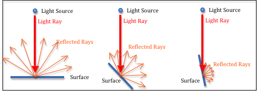

# 学习webGL

##### 学习的主要两个教程：

- https://webglfundamentals.org/
- http://learnwebgl.brown37.net/

在学习的过程中，可能经常在两个教程中跳跃。

每日总结中会有章节链接至对应的教程页面。

可能会出现重复的学习内容标题。

##### 前置知识：

> 矩阵
>
> 向量

##### 学习中的出现的知识：

> GLSL : 着色器使用的编程语言

##### 相关链接：

> http://learnwebgl.brown37.net/
>
> https://webglfundamentals.org/webgl/lessons/zh_cn/
>
> https://developer.mozilla.org/zh-CN/docs/Web/API/WebGL_API/Tutorial
>
> 关于 webGL 比 JavaScript API 绘制的优势 https://zhuanlan.zhihu.com/p/375851654


# 学习记录

关于学习的着色器相关知识时，优先学习**片段着色器**，工作重点。

学习着色器顺序 GLSL > 片段着色器 > 顶点着色器 


## 2021.10.11


### webGL的书写方法[^1.1]

webGL的书写方法使用的下面的形式，而不是第二种形式

```
var centerX;
var centerY;
var radius;
var color;
 
function setCenter(x, y) {
   centerX = x;
   centerY = y;
}
 
function setRadius(r) {
   radius = r;
}
 
function setColor(c) {
   color = c;
}
 
function drawCircle() {
   ...
}
```

第二种形式

```
function drawCircle(centerX, centerY, radius, color) { ... }
```


### WebGL应用基本都遵循以下结构[^1.1]

初始化阶段

- 创建所有着色器和程序并寻找参数位置
- 创建缓冲并上传顶点数据
- 创建纹理并上传纹理数据

渲染阶段

- 清空并设置视图和其他全局状态（开启深度检测，剔除等等）
- 对于想要绘制的每个物体
  - 调用 `gl.useProgram` 使用需要的程序
  - 设置物体的属性变量
    - 为每个属性调用 `gl.bindBuffer`, `gl.vertexAttribPointer`, `gl.enableVertexAttribArray`
  - 设置物体的全局变量
    - 为每个全局变量调用 `gl.uniformXXX`
    - 调用 `gl.activeTexture` 和 `gl.bindTexture` 设置纹理到纹理单元
  - 调用 `gl.drawArrays` 或 `gl.drawElements`

基本上就是这些，详细情况取决于你的实际目的和代码组织情况。基本上就是这些，详细情况取决于你的实际目的和代码组织情况。


### 相关链接

[^1.1]: webGL 绘制多个物体：https://webglfundamentals.org/webgl/lessons/zh_cn/webgl-drawing-multiple-things.html


## 2021.10.12


### 顶点着色器[^2.1]

1. [Attributes 属性](https://webglfundamentals.org/webgl/lessons/zh_cn/webgl-shaders-and-glsl.html#attributes-) (从缓冲中获取的数据)
2. [Uniforms 全局变量](https://webglfundamentals.org/webgl/lessons/zh_cn/webgl-shaders-and-glsl.html#uniforms-) (在一次绘制中对所有顶点保持一致值)
3. [Textures 纹理](https://webglfundamentals.org/webgl/lessons/zh_cn/webgl-shaders-and-glsl.html#textures-) (从像素或纹理元素中获取的数据)


### 片断着色器[^2.1]

一个片断着色器的工作是为当前光栅化的像素提供颜色值，通常是以下的形式

```
precision mediump float;

void main() {
   gl_FragColor = doMathToMakeAColor;
}
```

每个像素都将调用一次片断着色器，每次调用需要从你设置的特殊全局变量`gl_FragColor`中获取颜色信息。

片断着色器所需的数据，可以通过以下三种方式获取

1. [Uniforms 全局变量](https://webglfundamentals.org/webgl/lessons/zh_cn/webgl-shaders-and-glsl.html#uniforms-) (values that stay the same for every pixel of a single draw call)
2. [Textures 纹理](https://webglfundamentals.org/webgl/lessons/zh_cn/webgl-shaders-and-glsl.html#textures-) (data from pixels/texels)
3. [Varyings 可变量](https://webglfundamentals.org/webgl/lessons/zh_cn/webgl-shaders-and-glsl.html#varyings-) (data passed from the vertex shader and interpolated)


### GLSL[^2.2]

> GLSL全称是 Graphics Library Shader Language （图形库着色器语言），是**着色器使用的语言**。
>

它内建的数据类型例如`vec2`, `vec3`和 `vec4`分别代表两个值，三个值和四个值， 类似的还有`mat2`, `mat3` 和 `mat4` 分别代表 2x2, 3x3 和 4x4 矩阵。

#### 创建/使用

1. 利用JavaScript中创建字符串的方式创建GLSL字符串：用串联的方式（concatenating）， 用AJAX下载，用多行模板数据。或者在这个例子里，将它们放在非JavaScript类型的标签中。


```javascript
<script id="vertex-shader-2d" type="notjs">
 
  // 一个属性变量，将会从缓冲中获取数据
  attribute vec4 a_position;
 
  // 所有着色器都有一个main方法
  void main() {
 
    // gl_Position 是一个顶点着色器主要设置的变量
    gl_Position = a_position;
  }
 
</script>
```

2. 通过存储成 `.frag` 或 `.vert` 格式的方式。使用时，引用文件。


### 二维平移[^2.3]

平移就是普通意义的“移动”物体。

定义一些变量存储矩形的平移，宽，高和颜色。然后定义一个方法重绘所有东西，我们可以在更新变换之后调用这个方法。

如果我们想绘制一个含有成百上千个线条的几何图形， 将会有很复杂的代码。最重要的是，每次绘制JavaScript都要更新所有点。

这里有个简单的方式，上传几何体然后在着色器中进行平移。

```javascript
<script id="vertex-shader-2d" type="x-shader/x-vertex">
attribute vec2 a_position;
 
uniform vec2 u_resolution;
uniform vec2 u_translation;
 
void main() {
   // 加上平移量
   vec2 position = a_position + u_translation;
 
   // 从像素坐标转换到 0.0 到 1.0
   vec2 zeroToOne = position / u_resolution;
</script>
```

然后我们只需要在绘制前更新u_translation为期望的平移量。

```javascript
var translationLocation = gl.getUniformLocation(program, "u_translation");
   // 设置平移
gl.uniform2fv(translationLocation, translation);
```


### 二维旋转[^2.4]

#### 通过计算 x y 旋转

```javascript
<script id="vertex-shader-2d" type="x-shader/x-vertex">
attribute vec2 a_position;
 
uniform vec2 u_resolution;
uniform vec2 u_translation;
uniform vec2 u_rotation;
 
void main() {
  // 旋转位置
  vec2 rotatedPosition = vec2(
     a_position.x * u_rotation.y + a_position.y * u_rotation.x,
     a_position.y * u_rotation.y - a_position.x * u_rotation.x);
 </script>
```

绘制前更新u_translation为期望的平移量。

```javascript
var rotationLocation = gl.getUniformLocation(program, "u_rotation");
var rotation = [0, 1];

// 设置旋转
gl.uniform2fv(rotationLocation, rotation);
```

#### 调整角度

单位圆上的点还有一个名字，叫做正弦和余弦。所以对于任意给定角， 我们只需要求出正弦和余弦

就可以对几何体旋转任意角度，使用时只需要设置旋转的角度。

```javascript
function printSineAndCosineForAnAngle(angleInDegrees) {
  var angleInRadians = angleInDegrees * Math.PI / 180;
  var s = Math.sin(angleInRadians);
  var c = Math.cos(angleInRadians);
  return [s,c];
}
```


### 难点/疑问

需要深入了解 **GLSL**


### 相关链接

[^2.1]: WebGL 基础概念 https://webglfundamentals.org/webgl/lessons/zh_cn/webgl-fundamentals.html
[^2.2]: WebGL 着色器和GLSL https://webglfundamentals.org/webgl/lessons/zh_cn/webgl-shaders-and-glsl.html

[^2.3]:  二维平移 https://webglfundamentals.org/webgl/lessons/zh_cn/webgl-2d-translation.html
[^2.4]: 二维旋转 https://webglfundamentals.org/webgl/lessons/zh_cn/webgl-2d-rotation.html


## 2021.10.13

今天开始，不再所有的案例都模仿，并代码实现。（需要的时间太多，重点的才实操）


看完 http://learnwebgl.brown37.net/ 前两章。前两章主要讲的是使用webGL的前置知识。


### 二维缩放[^3.1]

缩放和[平移](https://webglfundamentals.org/webgl/lessons/zh_cn/webgl-2d-translation.html)一样简单，需要在JavaScript中绘制的地方设置缩放量。

```javascript
<script id="vertex-shader-2d" type="x-shader/x-vertex">
uniform vec2 u_scale;
 
void main() {
  // 缩放
  vec2 scaledPosition = a_position * u_scale;
</script>
```


```javascript
var scaleLocation = gl.getUniformLocation(program, "u_scale");
var scale = [1, 1];
// 设置缩放
gl.uniform2fv(scaleLocation, scale);
```


### 二维矩阵[^3.2]

该章大致阅读了一遍... :joy:


### 三维正射投影[^3.3]

该章大致阅读了一遍...... :joy:


### 三维透视投影[^3.4]

该章大致阅读了一遍......... :joy:


### 图形处理流程[^3.5]

将对象的矢量图形表示转换为光栅图像的过程由以下步骤执行：

| 流水线步骤：                                                 | 描述：                                                       | 执行者：                            |
| :----------------------------------------------------------- | :----------------------------------------------------------- | :---------------------------------- |
|  | 将数据输入管道，包括定义位置的模型顶点 (x,y,z)、定义方向的法线向量 (dx,dy,dz) 和颜色数据。 | CPU：JavaScript 代码                |
|  | 将模型平移、缩放和旋转到 3D 场景中所需的位置和方向。然后将所有东西移到镜头前。 | CPU：JavaScript 代码GPU：顶点着色器 |
|  | 将 3D 世界投影到 2D 观看屏幕上。                             | CPU：JavaScript 代码GPU：顶点着色器 |
|  | 剪掉不在相机视野中的所有东西。                               | CPU：JavaScript 代码GPU：顶点着色器 |
|  | 将 3D 对象坐标映射到光栅图像的像素坐标。                     | GPU：固定功能                       |
|  | 确定每个对象（点、线或三角形）覆盖哪些像素，并丢弃被其他对象隐藏的对象。 | GPU：固定功能                       |
|  | 确定代表对象的每个像素的颜色。                               | CPU：JavaScript 代码GPU：片段着色器 |
|  | 将像素的颜色添加到光栅图像，可能会将颜色与图像中已有的颜色组合。 | GPU：固定功能                       |
|  | 输出一个光栅图像，图像的每个像素一个颜色值。                 | GPU：固定功能                       |


### Learn_webgl 对象[^3.6]

对于 WebGL 程序，我们需要从服务器下载几种类型的数据文件：

- 我们的 3D 场景对象的模型数据
- 定义模型表面属性的材料描述，包括纹理贴图，以及
- 用于渲染的 WebGL 着色器程序。

这些文件的数量取决于场景的复杂性和渲染的复杂性。我们将使用一个被调用的 JavaScript 对象 `Learn_webgl`来下载所有这些文件。当您创建一个 `Learn_webgl`对 象时，您会向它传递一个着色器文件名列表和一个模型文件名列表。构造函数通过将每个列表中的文件数相加来确定需要下载的文件数：

```javascript
downloads_needed = shader_list.length + model_list.length;
number_retrieved = 0;
```

然后它继续调用`$.get()` (jQuery操作) 每个所需的文件。每次成功下载后，它将数据保存在一个对象中，递增 `number_retrieved`1，并调用一个名为 的函数 `_initializeRendering()`。此函数仅在检索到所有必需文件后才启动其画布的 WebGL 渲染。该函数如下所示：

```javascript
function  _initializeRendering ()  { 

  if  ( number_retrieved  >=  downloads_needed )  { 
    // 预处理模型数据
    // 开始渲染画布
  } 
}
```


### 难点/疑问

需要深入入入入入入了解 **矩阵乘法**，**线性代数**

- 线性代数 https://www.bilibili.com/video/BV1ys411472E?p=2


### 相关链接

[^3.1]: 二维缩放 https://webglfundamentals.org/webgl/lessons/zh_cn/webgl-2d-scale.html
[^3.2]: 二维矩阵 https://webglfundamentals.org/webgl/lessons/zh_cn/webgl-3d-orthographic.html

[^3.3]:  三维正射投影 https://webglfundamentals.org/webgl/lessons/zh_cn/webgl-3d-orthographic.html
[^3.4]: 三维透视投影 https://webglfundamentals.org/webgl/lessons/zh_cn/webgl-3d-perspective.html
[^3.5]: Computer Graphics - What and How http://learnwebgl.brown37.net/the_big_picture/3d_rendering.html
[^3.6]:  Asynchronous File Loading http://learnwebgl.brown37.net/browser_environment/asynchronous_loading.html


## 2021.10.14

看到http://learnwebgl.brown37.net/ 的第五章的第一个实例。先跳过，看第七章。


### 调试webGL

推荐使用 google chrome  **development tools**  中断点调试

#### 调试原理[^4.1]

WebGL 3D 图形程序是一个复杂的系统，需要强大的调试技能才能使其准确和健壮。以下调试原则将是您成功的关键。

- 只要有可能，从一个工作程序开始并以小增量修改它。如果您添加 100 行代码并且您的软件停止工作，那么您有 100 个地方可以查找您的问题。如果您添加四行代码并且您的软件停止工作，您有四个地方可以查看。在哪种情况下，您会更快地发现错误？
- 了解如何有效地使用浏览器的调试器。如果您的代码停止工作，请在新代码的第一行放置一个断点并重新加载您的网页。当执行在断点处停止时，一次一行地单步执行您的代码。在执行下一行之前，确保每个变量都有一个准确的值。如果变量的值不正确，您可以在执行下一行之前在控制台窗口中更改其值。这允许您在发现第一个错误后继续调试。
- 使用 Javascript 控制台进行试验。不要更改您的代码，重新加载网页，并“hope for the best”。当您的语句不能为变量生成所需的值时，请使用 Javascript 控制台来试验各种语句，直到找到可行的方法。然后使用经过验证的更正来修改您的代码。现在您可以重新加载您的网页并执行最终验证。您会惊讶于这将为您节省多少时间。


### 构建虚拟世界[^4.2]

假设一个世界是由对象组成的。我们需要对每个对象进行建模：

- 位置 **location**                                              - 参考场景的对象在哪里？
- 方向 **orientation**                                        - 对象转向或面向哪个方向？
- 体积 **volume**                                               - 对象占据什么 3 维空间？
- 表面特性（材质） **surface properties**   - 对象是什么颜色？物体是光滑的还是粗糙的？


### 模型位置 location[^4.3]

位置是相对的，每个**场景** (scene) 会有一个**世界原点** (global origin) ，所有的模型都会相对于该唯一位置进行定位。

此外，还有每个对象**本地原点** (local origin)， 对象的各个部分都来自该**原点**。例如：一个房间中的桌子。

- 位置总是相对的！
- 一个**世界原点**是从的所有对象都位于一个场景的独特位置。一个场景只有一个独特的**世界原点**
- 场景中的每个单独对象都有自己的**本地原点**，对象的各个部分都来自该**原点**。
- 场景中的对象通过指定它们的**本地原点**和场景的**世界原点**之间的关系来定位。

#### 3维坐标描述

主要有两种：

| 描述                                                         | 示例图                                                       |
| ------------------------------------------------------------ | ------------------------------------------------------------ |
| 使用右手（并假设 y 轴朝上），将拇指指向 x 轴方向，食指指向 y 轴方向。对于右手坐标系，您的中指将指向 z 轴的方向。如果您的拇指指向右侧，则 z 轴将朝向您。 |  |
| 如果您用左手将拇指指向 x 轴方向，食指指向 y 轴方向，则您的中指将指向相反的方向，或远离您。这是一个左手坐标系。 |                |

**three.js** 的坐标使用的是第二种。

#### WebGL 点

它是一个 4 分量值: (x,y,z,w)。

*x*、*y*、*z*是沿**笛卡尔坐标系轴的**距离，w用于透视计算。


### 方向[^4.4]

表示方向的方法有很多种，包括距离和角度的各种组合，我们可以通过类似于上一课位置的讨论来开发一些不同的方法。但是让我们跳到 **向量** 的标准表示。

#### 向量 Vectors

- 方向总是相对于某物！
- 向量表示相对于参考系的**绝对方向**。
- 当与起点结合时，向量表示**相对方向**。
- 计算机图形通常使用两个距离表示二维向量，<dx,dy> 。
- 使用三个距离表示的 3 维向量，<dx,dy,dz>
- 矢量代表方向和距离。
- 使向量具有一个单位的长度将其“标准化”为该方向的唯一表示。
- 向量无法“移动”，因为它们没有位置！

#### 操作向量

可以操纵向量来改变其方向和长度。以下操作具有物理意义：

- 旋转：改变矢量的方向。
- 缩放：改变向量的长度。
- 归一化 (Normalize)：保持向量的方向不变，但使其长度为 1 个单位。
- 添加两个向量。结果：表示方向的向量，该方向是原始方向的总和。
- 减去两个向量。结果：表示方向的向量，该方向是原始方向的差异。
- 给一个点，添加一个向量。结果：一个位于新位置的新点。
- 给一个点，减去一个向量。结果：一个位于新位置的新点。


### 体积/表面 (Volume / Surfaces) [^4.5]

#### 三角形

几乎所有渲染算法都只知道如何渲染三角形！三角形是使用我们在之前课程中定义的位置和方向值来定义的。

- 三角形是定义封闭区域的**最简单的几何形状**。三角形有一个内部区域和一个外部区域。

- 三角形总是**平面**的——它总是定义一个平面。

- 三角形将 3 维空间划分为**三个不同的区域**。3 维空间中的所有点都位于 

  - 由三角形定义的平面中。

  - 在平面的一侧。

  - 在平面的另一侧。

    将三角形视为定义一张平面纸。按照惯例，我们可以说三角形的*一侧*是*正面*，另一侧是*背面*。通过组合三角形，我们可以创建具有*内部*和*外部的*形状。

- **三角形总是凸的**；三角形不可能是凹的。**渲染凹多边形**比渲染凸多边形**更难**。


#### 定义 3D 对象

任何 3 维对象的形式都可以用一组三角形来近似，称为[三角形网格](https://en.wikipedia.org/wiki/Triangle_mesh)。

对象形状的准确性取决于用于对其进行建模的三角形数量。


划分三角形网格到的最有效的基团`TRIANGLES`， `TRIANGLE_STRIP`和`TRIANGLE_FAN`套是一个非常困难的问题。


### 表面-材质 Material Properties[^4.6]

表面特性包括但不限于：

- 表面是什么颜色？颜色是纯色还是多色？
- 表面如何反射光？它是闪亮的还是沉闷的？
- 表面是否光滑、粗糙或凹凸不平？
- 表面是平的还是弯曲的？
- 表面是否透明以允许一些光线穿过它？如果是这样，光是否会折射（改变其传播方向）？


### 颜色[^4.7]

 WebGL 程序通常使用的颜色: **RGB 色** (red,green,blue)。 **最大值为1**

加上透明度就是 **RGBA 色**。 (red,green,blue,**A**lpha)

WebGL 1.0 要求所有**顶点属性**都是**浮点值**。


### 纹理贴图[^4.8]

#### 程序贴图

通过程序计算结果生成对应的颜色。

#### 图像贴图

通过映射，展示图像中特定位置的颜色。

##### WebGL 实现

WebGL 支持程序和基于图像的**纹理映射**。

- 程序纹理映射是通过在**片段着色器**编写函数来执行的。

- 基于图像的纹理映射通过以下方式执行：

  - 从服务器下载适当的图像。、

  

  - 创建 GPU 纹理对象并将图像保存到 GPU 的内存中。
  - 在*片段着色器中*使用表查找功能从图像中获取特定像素的颜色。


### 灯光模型[^4.9]

当光线照射到物体时，会发生以下四种情况中的一种或多种：

- 光线反射并沿不同方向熄灭。反射光的方向由面部的表面特性决定。
- 光被物体吸收并转化为能量，随着时间的推移加热物体。（这称为[吸收](https://en.wikipedia.org/wiki/Absorption_(electromagnetic_radiation))。）
- 光穿过物体并继续前进，但轨迹不同。（穿过物体的光称为[透明度](https://en.wikipedia.org/wiki/Transparency_and_translucency)，方向的变化称为[折射](https://en.wikipedia.org/wiki/Refraction)。）
- 光线进入物体，在物体内部反弹，然后在与它撞击的不同位置离开物体。（这称为 [次表面散射](https://en.wikipedia.org/wiki/Subsurface_scattering)。）

#### **环境光**

环境光的量决定了场景中的整体光。(0.1, 0.1, 0.1) 的环境光将模拟一个黑暗的房间，而 (0.4, 0.4, 0.4) 的环境光将模拟一个光线充足的房间。

#### 漫反射光

从物体表面反射的光量与表面相对于光源的方向有关。如果光线“直接”照射到表面，大部分光线将被反射。如果光只是从物体的一侧“擦掉”，那么反射的光就很少。

如果我们取表面法向量和光线之间夹角的余弦值，就可以得到反射光的数量。

#### 镜面反射光

如果物体是光滑的，从物体表面反射的一些光可以直接反射到观察者的眼睛（或相机的镜头）中。这会创建一个“镜面高光”，即光源的颜色，而不是物体的颜色，因为您实际上是在看到光源的光。

#### WebGL 实现

WebGL 中的所有灯光效果都由程序员在片段着色器中完成。您将执行以下操作：

- 从光源模型获取环境光量。
- 计算表面法向量和光方向之间的角度。
- 将角度的余弦乘以表面的漫反射颜色。
- 计算光反射和相机方向之间的角度。
- 将角度的余弦乘以灯光模型的镜面反射颜色。
- 添加环境、漫反射和镜面反射颜色。这是三角形表面此片段的像素颜色。


### 表面法线 Surface Normals[^4.10]

Surface Normals，可能称为表面法线，曲面法线。

用于计算颜色的表面的基本属性是表面法线。可以使用表面法线来增强对象的视觉渲染效果。

- 每个三角形一个法向量

- 每个顶点一个法向量

- 每像素一个法向量


### 行 line[^4.11]

webGl 支持行渲染，例如：渲染人物或物体的轮廓光。


### 3D模型[^4.12]

请注意 3D 模型的这些特征：

- 目标是表示对象的形式，因此对象的表面通常是建模的唯一对象。也有例外，例如用于模拟发动机内部工作的模型。
- 3D 模型通常是一个[多边形网格](https://en.wikipedia.org/wiki/Polygon_mesh)，它是一组连接的多边形。具有超过 3 条边的多边形将转换为三角形进行渲染。这些被称为**三角形网格** (triangular meshes) 。
- 用于表示对象形式的多边形数量决定了模型的准确性。更多的多边形意味着更高的精度，但代价是需要更多的内存和更慢的渲染。
- 三角形的场景中的总数通常是是否场景可在1/30下被呈现的决定因素第 一个第二的。通常会减少一个模型中的三角形数量，以便另一个模型可以拥有更多。
- 模型作为一个单元进行操作。如果对象的各个部分独立移动，则这些部分必须单独建模。例如，如果您有一个盖子打开的盒子，这将被建模为两个单独的对象 - 一个五面盒子和一个盖子。


### blender[^4.13]

一个开源、免费的建模和动画工具。

Blender 是许多工具的组合。它是一个：

- 建模 **modeler**                             创建 3D 模型
- 渲染器 **renderer**                         生成 3D 模型的照片级渲染
- 装配 **rigger**                                  创建“装置”，这是专门为动画设计的 3D 模型
- 动画系统 **animation system**   创建关键帧动画
- 合成器 **compositor**                   组合来自各种来源的图像以创建视频帧
- 视频渲染器 **video renderer**      以各种视频格式输出完整的动画

#### 一些问题

Blender 使用右手坐标系，但与 WebGL 相比具有不同的默认视图方向。

- 在 Blender 中，地平面是 XY 平面，Z 轴向上。
- 在 WebGL 中，地平面是 XZ 平面，Y 轴指向上方。


### OBJ 数据格式[^4.14]

我们将使用 OBJ 格式为我们的 WebGL 程序定义模型，因为：

- OBJ 文件是纯文本，它允许在 JavaScript 中读取和解析数据。
- 纯文本格式消除了 Web 服务器和各种客户端浏览器之间的任何二进制不兼容性。
- 文件格式是公开的，并能很好的在其他的3D应用中被支持。


### webGL渲染简介[^4.15]

WebGL API 并未针对程序员进行优化；它针对快速硬件渲染进行了优化。

不要指望高级命令。WebGL API 是一组非常低级的命令，用于控制硬件级功能。

#### 着色器程序简介 Shader Programs

**顶点着色器**和**片段着色器**共享变量。顶点着色器通常会设置要使用的片段着色器的值。

着色器程序使用三种类型的数据：

| 类型        | 描述                                                         |
| ----------- | ------------------------------------------------------------ |
| `uniform`   | 与图形管道的执行相同的数据值。例如，如果您要为每个处理过的顶点分配相同的颜色，那么该颜色可能是一个`uniform` 变量。当你想到一个`uniform`值时，想想一个固定的、不变的、不变的值。 |
| `attribute` | 当图形管道处理顶点时，每个顶点都会发生变化的数据值。典型`attribute`值是顶点的 (x,y,z) 位置。当您想到一个`attribute` 值时，请始终在术语中包含顶点，例如 。`vertex attribute` |
| `varying`   | 在图形管道执行时为每个**片段**更改的数据值。`varying`变量允许每一个构成一个点，线或三角形像素被分配一个不同的颜色。 |

JavaScript 程序和 GPU 之间的任何通信都会减慢渲染速度。要获得最大渲染速度，您需要尽量减少对 WebGL API 的 JavaScript 函数调用。

#### 预处理步骤

在较高的抽象层次上，预处理步骤是：

1. 获取您将要渲染到的 HTML**画布** (canvas) 元素。

2. 获取 canvas 元素的 **WebGL内容**，通常称为 **gl**。

3. 为 **gl** 上下文设置所需的状态。

4. 编译您的**顶点着色器** (vertex shader) 和**片段着色器** (fragment shader) 程序并将其链接到**渲染程序** (rendering program) 中。（可以创建多个渲染程序。）

5. 获取对**渲染程序**中变量的引用，以便您可以在渲染时设置它们的值。

6. 对于场景中的每个模型：

   1. 将您的 OBJ 模型数据转换为适当的数组以进行渲染。
   2. 在 GPU 的内存中创建一个**缓冲区对象**。
   3. 将您的模型数据复制到**缓冲区对象**中。

#### 渲染步骤

每次渲染场景时，您的 JavaScript 程序都必须执行以下步骤：

1. 清除将渲染保留为背景颜色的颜色缓冲区。
2. 如果您要**隐藏没被展示面** (hidden surface) ，请清除**深度缓冲区** (depth buffer) 。
3. 选择您的着色器程序。
4. 对于场景中的每个模型：
   1. 将 `uniform` 变量的值传递给着色器程序。
   2. 将每个 `attribute` 变量附加到适当的**缓冲区对象**。
   3. 调用 WebGL `gl.drawArrays()` 函数。


### 着色器入门[^4.16]

- **顶点着色器**必须设置一个变量的值：`gl_Position`
- **片段着色器**必须设置一个变量的值：`gl_FragColor`

管道中各个阶段之间传递的不仅仅是这些值。 **顶点着色器**和**片段着色器**基于顶点共享变量。

因此，**顶点着色器**通常会将颜色和其他信息与 `gl_Position` 值相关联。


### 缓冲区对象入门 Buffer Objects[^4.17]

**缓冲对象** (Buffer Object) 是在GPU存储器的连续块，可以通过在GPU上执行的着色器程序非常快速地被访问。

**缓冲区对象** 存储着色器程序渲染所需的数据。**缓冲区对象**的内容始终是**一维数组**。

#### 创建和初始化缓冲区对象

```javascript
function createAndFillBufferObject(gl, data) {
  var buffer_id;

  // Create a buffer object
  buffer_id = gl.createBuffer();
  if (!buffer_id) {
    out.displayError('Failed to create the buffer object for ' + model_name);
    return null;
  }

  // Make the buffer object the active buffer.
  // 将缓冲区绑定到目标
  gl.bindBuffer(gl.ARRAY_BUFFER, buffer_id);

  // Upload the data for this buffer object to the GPU.
  // 创建并初始化了Buffer对象的数据存储区，并将其更新到GPU中。
  gl.bufferData(gl.ARRAY_BUFFER, data, gl.STATIC_DRAW);

  return buffer_id;
}
```

请注意有关此代码的以下几点：

- 创建**对象缓冲区**只不过是为新缓冲区保留一个新 ID。

- 您通常会有许多**对象缓冲区**，其中只有一个是“活动缓冲区”。当您对*缓冲区对象*发出命令时，您总是在操纵“活动缓冲区”。该`bindBuffer`函数只是使用 buffer_id 将“活动缓冲区”更改为特定缓冲区。

- 该 `bufferData` 函数将数据从 JavaScript 程序复制到 GPU 的**缓冲区对象中**。如果**缓冲区对象**中已有数据， 则删除其当前内容并添加新数据。

- 将数据复制到 GPU 时您将收到的主要错误是 OUT_OF_MEMORY。上面的代码应该通过调用来检查**gl**错误`gl.getError()`，但我们会担心稍后会发现错误。

  

创建*缓冲区对象*是一个预处理步骤，只需要发生一次。[^4.18]


### 相机 Cameras [^4.19]

在现实世界中，场景保持静止，而一个人通过移动到各个有利位置来拍照。

但事实证明，在虚拟世界中，保持相机静止并在相机前移动场景在数学上更有效。

我们可以很容易地在镜头前移动整个场景。

#### 相机定义

我们通常将相机的位置称为“眼睛”位置，并使用全局点（eye_x、eye_y、eye_z）定义其位置。

相机的方向最好由定义局部右手坐标系的三个正交轴来定义。为了使这些轴与全局 x、y 和 z 坐标轴分开，让我们使用名称*u*、*v*和*n*。（名称是任意的）

```
u --> x 
v --> y 
n --> z
```

#### 指定相机

- 指定相机的位置
  - 这实际上给了我们两个值——**眼睛** (eyes)位置和一个参考点来形成相机的坐标系轴。
- 指定相机正在查看的位置
  - 该值可以是沿视线在相机前面的任何点。它沿视线的确切位置并不重要。该点定义了*-n*轴的方向。由于我们将坐标系轴归一化为单位长度，因此该向量的方向是我们唯一关心的事情。
  - 作确保该点和眼睛位置形成一个向量。如果两个点位于同一位置，则*-n*轴将不是有效的向量，并且该`lookAt()`函数将无法创建有效的相机坐标系。
- 为相机指定 “上方”的大致方向
  - 该向量不必精确。典型值为 <0,1,0>，指向 Y 轴方向。当<0,-1,0>时，相机的视角将会颠倒。
  - 这个向量的**叉积** (cross product) 和**视线向量** (vector) 的负值将产生相机坐标系的**u**轴。
  - 如果“向上”向量正好沿着相机的视线，则**叉积**计算将失败，相机坐标系将无效。作为程序员，您有责任确保视线矢量和“向上矢量”不指向同一方向。
  - 相机的最后轴的坐标系统，**v**，其直接指向“上”从照相机通过取计算出的*交叉乘积* 的的**ü**和**Ñ**载体。

##### 操作**lookAt()**创建的虚拟相机的参数，笔记：

- 眼睛位置在相机的中心
- 该**中心**位置开始在原点，这也是小部件的中心。该**中心**，如果你从原点将其移开的位置是可见的。请注意相机如何始终指向此位置。
- “向上”矢量绘制为黑色线段。
- 鼠标拖动将允许您获得左侧画布窗口的不同视图。
- 场景以透视模式渲染，因此您可以感知深度。

操作函数 `lookAt(M, eye_x, eye_y, eye_z, center_x, center_y, center_z, up_dx, up_dy, up_dz)` 


### 相机数学[^4.20]

暂时跳过，对矩阵和向量的了解还不够深入


### 相机运动[^4.21]

”推拉摇移跟甩“

摄像机的不动的情况：“推拉摇移”操作。

摄像机的运动的情况：“升降、旋转、晃动”。 

##### lookat()函数操作

`lookat`函数需要 3 个元素：

- 眼睛位置：相机当前位置坐标

- 中心位置：相机对焦的中心坐标

- “向上” 向量：指定哪个方向为相机的上方。

如果摄像机的 **u** 轴当前为 <0,-1,0>，它沿 -Y 轴指向下方，如果您**向右**移动该摄像机，您将沿 -Y 轴移动。**相机运动是相对于当前相机！**


### 难点/疑问

- 需要深入了解 **向量** Vectors。
- 坐标使用 (x,y) 表示
- 向量使用 <x,y> 表示
- 模型的表面，材质需要配合灯光
- 灯光中的 反射计算方式：表面法线、表面法向量和光线之间夹角
- 学习blender，链接在**相关链接**中 4.13 
- .obj 数据类型的详解
- 归一化向量
- 不太明白“指定相机”中的描述：需要配合http://learnwebgl.brown37.net/07_cameras/camera_lookat/camera_lookat.html 再次了解


### 相关链接

[^4.1]: Debugging http://learnwebgl.brown37.net/browser_environment/debugging.html
[^4.2]: Describing Virtual Worlds http://learnwebgl.brown37.net/model_data/model_introduction.html
[^4.3]: Modeling Location http://learnwebgl.brown37.net/model_data/model_points.html
[^4.4]: Direction / Orientation http://learnwebgl.brown37.net/model_data/model_direction.html
[^4.5]:Volume / Surfaces http://learnwebgl.brown37.net/model_data/model_volume.html
[^4.6]: Material Properties http://learnwebgl.brown37.net/model_data/model_material_properties.html
[^4.7]: color http://learnwebgl.brown37.net/model_data/model_color.html
[^4.8]: texture maps http://learnwebgl.brown37.net/model_data/model_texture_maps.html
[^4.9]: Light Modeling http://learnwebgl.brown37.net/model_data/model_light_reflection.html
[^4.10]: Surface Normals http://learnwebgl.brown37.net/model_data/model_surface_normals.html
[^4.11]: line http://learnwebgl.brown37.net/model_data/model_lines.html
[^4.12]: 3D Modeling http://learnwebgl.brown37.net/modelers/modelers.html
[^4.13]: blender http://learnwebgl.brown37.net/modelers/blender.html
[^4.14]: OBJ Data Format http://learnwebgl.brown37.net/modelers/obj_data_format.html
[^4.15]: Introduction to Rendering http://learnwebgl.brown37.net/rendering/introduction.html
[^4.16]: shader primer http://learnwebgl.brown37.net/rendering/shader_primer.html
[^4.17]: A Primer on Buffer Objects http://learnwebgl.brown37.net/rendering/buffer_object_primer.html
[^4.18]: Example 1: One Color per Model  http://learnwebgl.brown37.net/rendering/render_example_01.html
[^4.19]: Introduction to Cameras http://learnwebgl.brown37.net/07_cameras/camera_introduction.html
[^4.20]: Camera Math http://learnwebgl.brown37.net/07_cameras/camera_math.html
[^4.21]: Camera Movement http://learnwebgl.brown37.net/07_cameras/camera_movement.html


## 2021.10.15

这是每日的记录，相机部分的内容可能会出现重复。后期会重新整理文档，将其整合。


### 移动相机[^5.1]

几乎所有相机运动都与相机的参考系有关。

#### lookat()函数

该函数`LookAt`需要两个点和一个向量来设置相机变换矩阵。需要： 

1) 相机的位置
2) 沿视线的点的位置
3) 向上的方向

##### 基本步骤是：

- 计算相机的**u**轴。
- 使用**u**轴方向的单位向量，按移动距离缩放向量，然后将此向量添加到**eye**和**中心点** (center points) 。

#### 修改相机的定义

使用相机的基本定义来操作相机：一个**位置**和三个**坐标轴**。

```javascript
self.eye = P.create(0, 0, 0);  // (x,y,z), origin
self.u   = V.create(1, 0, 0);  // <dx,dy,dz>, +X axis
self.v   = V.create(0, 1, 0);  // <dx,dy,dz>, +Y axis
self.n   = V.create(0, 0, 1);  // <dx,dy,dz>, +Z axis
```

三个向量存储相机的方向。如果我们不改变三个向量，相机的方向将保持不变。因此，只需要调整 **eye** 坐标就能实现移动


### 旋转相机[^5.2]

三个向量构建了一个相机的所有视野面，通过调整三个向量，能够做到球形视野范围。

涉及**旋转的**相机移动将围绕相机坐标系的当前轴之一旋转。如果相机**倾斜**，则旋转围绕*u*轴。如果相机**平移**，则旋转围绕*v*轴。如果摄像机**黑话**，旋转是关于*Ñ*轴线。相机运动几乎总是关于相机的当前参考系。

与上一章一样，操作实际的相机定义（一个点和 3 个轴）需要较少的计算，但需要对相机矩阵变换有更多的数学理解。


### 路径上的点[^5.3]

计算动画运行时，每个关键帧，当前在该路径上运动到的点的位置（坐标）。

#### 参数方程

$$
p  =  (1 - t) * p1  +  t * p2
$$

请注意以下几点：

- 当 t = 0.0 时，方程变为 p = p1。

- 当 t = 1.0 时，方程变为 p = p2。

- 当 t = 0.25 时，方程变为 `p = 0.75 * p1 + 0.25 * p2`。点 p 与 p1 相距 25%，与 p2 相距 75%。

- t + (1-t) 总是等于 1.0。这意味着我们总是得到 100% 的两点。对于任何 t 值，您将取 p2 的 t% 和 p1 的剩余百分比。

- 对于 3D 空间中的直线，我们计算 

- 个值，但只改变单个参数 t：
  - $$
    p_x= (1-t)*p1_x+t*p2_x
    $$
  
  - $$
    p_y= (1-t)*p1_y+t*p2_y
    $$
  
  - $$
    p_Z= (1-t)*p1_Z+t*p2_Z
    $$

所有参数方程都采用**原始值的百分比**来生成中间值。这是一个非常简单而优雅的想法。

#### 圆形路径

由于所有的旋转都是围绕原点进行的，需要做以下三个步骤：

1. 将中心点平移到全局原点。
2. 使用旋转变换绕旋转轴旋转。
3. 将中心点平移回其原始位置。


### 随时间改变的路径[^5.4]

`dt` : 恒定速度下，完成每帧动画所经过的路径百分比 ( % ) 

#### 速度和加速度

你有 3 个设计动画的场景：

1. 您决定移动的距离和移动的时间。
2. 您决定移动速度和移动时间。
3. 您决定移动距离和速度。

##### 距离、时间和速度使用以下基本公式相互关联：

```javascript
speed    = distance / time ; // 速度 = 路程 / 时间
distance = speed    * time ; // 距离 = 速度 * 时间
time     = distance / speed; // 时间 = 距离 / 速度
```

对于动画，您可以以**秒**或**帧**为单位测量**时间**。可以使用与您的虚拟场景一致的任何单位来测量距离。

请记住，WebGL 是无单位的，您需要为**所有测量使用一致的单位**。

##### 恒定速度运动

```javascript
number_frames = ending_frame - starting_frame + 1;
dt = 1.0 / (number_frames-1); // 完成每帧动画所经过的路径百分比

seconds = (number_frames-1) / (30 frames/ 1 sec);
```

##### 不恒定速度运动

一个动画的不恒定速度运动的为下表:

<table>
    <tr>
      <th>帧数</th>
      <th>100</th>
      <th>101</th>
      <th>102</th>
      <th>103</th>
      <th>104</th>
      <th>105</th>
      <th>106</th>
      <th>107</th>
      <th>108</th>
      <th>109</th>
      <th>110</th>
    </tr>
    <tr>
      <td>dt =</td>
      <td></td>
      <td>?</td>
      <td>?</td>
      <td>?</td>
      <td>dt</td>
      <td>dt</td>
      <td>dt</td>
      <td>dt</td>
      <td>dt</td>
      <td>?</td>
      <td>?</td>
    </tr>
    <tr>
      <td>t =</td>
      <td>0.000</td>
      <td>?</td>
      <td>?</td>
      <td>?</td>
      <td>?</td>
      <td>?</td>
      <td>?</td>
      <td>?</td>
      <td>?</td>
      <td>?</td>
      <td>1.00</td>
    </tr>
    <tr>
      <td></td>
      <td colspan="4">加速</td>
      <td colspan="5">恒速</td>
      <td colspan="2">减速</td>
    </tr>
  </table>
假设加速曲线如下：


```javascript
1.0  =  // 总路程
    	1 / 6 * dt  +  3 / 6 * dt  +  5 / 6 * dt  +  // 加速度
 		dt  +  dt  +  dt  +  dt  +  dt  +  // 恒速
		3 / 4 * dt  +  1 / 4 * dt ; // 减速
```

可以计算出，完整路程时， `7.5*dt === 1.0` 。所以 `dt` 必须是 1/7.5 或 0.1333。 

<table>
    <tr>
      <th>帧数</th>
      <th>100</th>
      <th>101</th>
      <th>102</th>
      <th>103</th>
      <th>104</th>
      <th>105</th>
      <th>106</th>
      <th>107</th>
      <th>108</th>
      <th>109</th>
      <th>110</th>
    </tr>
    <tr>
      <td>dt =</td>
      <td>0.000</td>
      <td>0.022</td>
      <td>0.067</td>
      <td>0.111</td>
      <td>0.133</td>
      <td>0.133</td>
      <td>0.133</td>
      <td>0.133</td>
      <td>0.133</td>
      <td>0.100</td>
      <td>0.033</td>
    </tr>
    <tr>
      <td>t =</td>
      <td>0.000</td>
      <td>0.022</td>
      <td>0.088</td>
      <td>0.200</td>
      <td>0.333</td>
      <td>0.467</td>
      <td>0.600</td>
      <td>0.733</td>
      <td>0.866</td>
      <td>0.966</td>
      <td>1.000</td>
    </tr>
    <tr>
      <td></td>
      <td colspan="4">加速</td>
      <td colspan="5">恒速</td>
      <td colspan="2">减速</td>
    </tr>
  </table>

这个`dt`值是 0.133，而对于原来的“恒速”问题，这个`dt`值是 0.1。

**持续运动的速度**必须更大以弥补**加速和减速过程中损失的时间**。


### 更新屏幕和动画[^5.5]

#### 双缓冲 Double Buffering

WebGL 自动实现 **双缓冲**  ( Double Buffering ) 。

它总是将您的图形渲染到屏幕外的帧缓冲区中。屏幕上可见的是“第二个”帧缓冲区——因此称为“双”缓冲。

**渲染是在屏幕外完成的**，因此用户**永远不会看到单个像素的变化**。

在屏幕外帧缓冲区中的所有像素都已分配颜色并且屏幕外缓冲区已复制到屏幕的帧缓冲区后，**用户始终会看到已完成的渲染**。*双缓冲*是标准做法，这就是 WebGL 自动实现它的原因。

#### 更新屏幕显示

WebGL 程序通常设计为以特定的帧速率制作动画，并且该帧速率需要是显示器刷新率的倍数。

#### requestAnimationFrame() 函数

可以使用 JavaScript 计时器事件构建 WebGL 动画，但计时器事件不是为动画设计的。

JavaScript 引入了一个专门用于动画的函数，称为 `requestAnimationFrame`. 此函数将请求在下一次刷新绘制过程尝试更新屏幕帧缓冲区之前调用指定的回调函数，但需要注意的是，如果 WebGL 窗口不可见，则不会执行任何操作。

##### 典型的动画函数执行以下任务：

- 计算自上一帧渲染以来经过的时间量。
- 如果是时候渲染一个新帧：
  - 更改适当的场景变量
  - 渲染场景
- 调用`requestAnimationFrame`以在将来继续渲染。

##### 下面显示了一个示例动画函数。

```
//------------------------------------------------------------------------------
self.animate = function () {

  var now, elapsed_time;

  if (scene.animate_active) {

    // How much time has elapsed since the last frame rendering?
    now = Date.now();
    elapsed_time = now - previous_time;

    if (elapsed_time >= frame_rate) {
      // Change the scene.
      scene.angle_x -= 0.5;
      scene.angle_y += 1;

      // Render the scene.
      scene.render();

      // Remember when this scene was rendered.
      previous_time = now;
    }

    requestAnimationFrame(self.animate);
  }
};
```

请注意有关此代码的以下内容：

- 该 `requestAnimationFrame` 设置回调同样的功能它在不在。
- 该 `previous_time` 变量在此函数之外声明，因此它可以从一个函数调用到下一个函数调用保留其值。
- 必须有某种机制来停止动画。此代码使用场景对象中变量名为 `animate_active` 。通过将设置 `false`  ，外部进程可以停止动画 。
- 准确计时要求您跟踪从一帧渲染开始到下一帧开始的时间。请注意，`Date.now()` 在任何渲染之间调用一次，并且该值保存在局部变量中。该局部变量用于 `previous_time` 在渲染完成后更新值。不要再打调用`Date.now()`了。如果您这样做了，您将在不考虑渲染时间的情况下计算帧之间的时间。
- 该变量`frame_rate`设置为为每帧分配的毫秒数。一个典型的任务是：`var frame_rate = 16; // 16 milliseconds = 1/60 sec`


### 难点/疑问

归一化向量


### 相关链接

[^5.1]: Moving a Camera http://learnwebgl.brown37.net/07_cameras/camera_linear_motion.html
[^5.2]:rotating a Camera http://learnwebgl.brown37.net/07_cameras/camera_rotating_motion.html
[^5.3]:Points Along A Path http://learnwebgl.brown37.net/07_cameras/points_along_a_path.html
[^5.4]:Timing Along A Path http://learnwebgl.brown37.net/07_cameras/timing_along_a_path.html
[^5.5]:Screen Updates and Animation http://learnwebgl.brown37.net/07_cameras/screen_updates_and_animation.html


## 2021.10.18


### 投影简介[^6.1]

计算机图形中有两种标准投影:

- **正交投影** 保持平行线，但是没有提供深度感。
- **透视投影** 提供深度感，但平行线朝消失点倾斜。 

#### 投影变换的主要任务：是将 3D 场景投影到 2D 屏幕上

投影转换还为这些后续任务做准备：

- 剪裁 - 删除不在相机视线范围内的元素。
- 视口映射 - 将相机的**查看窗口**转换为图像的像素。
- 隐藏表面去除 - 确定哪些对象位于其他对象的前面。

#### 剪辑

> 考虑如何使用编程逻辑完成剪切点。

要确定定义为 (x,y,z) 的点是否在裁剪体积内，您可以编写如下代码：

```
if (x >= -1 and x <= 1 and
    y >= -1 and y <= 1 and
    z >= -1 and z <= 1)
  point_is_visible = true;
else
  point_is_visible = false;
```

但是，由于**剪切量是均匀**的并且关于原点对称，我们可以使用**绝对值**函数简化此代码：

```
if (abs(x) <= 1 and abs(y) <= 1 and abs(z) <= 1)
     point_is_visible = true;
else
     point_is_visible = false;
```

此外，您可以使用如下简单的赋值来设置布尔值：

```
point_is_visible = (abs(x) <= 1 and abs(y) <= 1 and abs(z) <= 1)
```

实际上裁剪是在**齐次坐标** (Homogeneous Coordinates) 中完成的。对于 (x,y,z,w) 顶点，裁剪测试将是

```
point_is_visible = (abs(x) <= w and abs(y) <= w and abs(z) <= w)
```

#### 什么时候处理投影变化

> 投影变换必须在场景移动到虚拟摄像机前之后、裁剪发生之前发生。
>

投影操作可以使用 4×4 矩阵乘法来执行，因此它通常与**模型**变换和**相机**（或**视图**）变换相结合，这些变换已经在管道的前几阶段在概念上执行。

**模型**、**视图**和**投影** 转换通常使用单个矩阵乘法来执行。

#### 顶点变换方程式

$$
VertexTransform =  [ProjectionMatrix]  *  [ViewMatrix]   *   [ModelMatrix]
$$


### 正交投影[^6.2]

> 工程领域使用**正交**投影来创建模型的准确渲染。它们保持平行线，但不提供深度感。
>

#### createOrthographic() 函数

> 功能 `createOrthographic()` 中 `Learn_webgl_matrix.js` 模块创建的正投影变换矩阵。

该函数需要 6 个参数：

```javascript
/** -----------------------------------------------------------------
 * Create an orthographic projection matrix.
 * @param left   Number x轴的最左侧，裁切的最左边
 * @param right  Number x轴的最右侧，裁切的最右边
 * @param bottom Number y轴的最下边，裁切的最上边
 * @param top    Number y轴的最上边，裁切的最下边
 * @param near   Number z轴起始的裁切范围 (最近视距)
 * @param far    Number z轴最远的裁切范围 (最远视距)
 * @return Float32Array The orthographic transformation matrix
 */
function createOrthographic(left, right, bottom, top, near, far) // 创建正投影变换矩阵
```

请确保您**观察正交投影**的以下特征：

- 视域外的基本元素（点、线或三角形）从视图中剪掉。（单个元素可以部分可见。）
- 有两个相同的模型，但每个模型与相机的距离不同。请注意：两个模型的渲染大小相同。
- 模型中的**平行线**在渲染中是**平行**的。
- 如果投影的宽高度的纵横比与画布的宽高度的纵横比不同，则**渲染失真**。
- 对于**left**，**right**，**bottom**和**top**的值是直观的。
  **near** 和 **far** 的值不直观。最重要的是，考虑要包含在渲染中的沿 z 轴的值范围。**near** 将是最大的 z 值，**far**将是最小值。需要**翻转**这两个值，因为使用的**左手坐标系**。
  例如：如果您想查看 z = 10 和 z = 2 之间的所有内容，则使 Near = -10 和 far = -2。如果您想查看 z = -3 和 z = -12 之间的所有内容，则使 near = 3 和 far = 12。例如，如果您想查看原点 10 个单位内的所有内容，您的参数为`createOrthographic` 会 `(-10, 10, -10, 10, -10, 10)` 。您还可以将 **near** 和 **far** 值视为沿-Z 轴的距离，允许负距离。
- 如果*left*的值大于*right*的值，则世界将围绕 Y 轴进行镜像。如果*底部*的值大于*顶部*的值，则世界是关于 X 轴的镜像。如果您混淆了*near* 和*far*值，则深度裁剪将向后。
- 的*观察窗*是的前侧*观看的体积*。它在左下角由点*(left, bottom, near) 定义*，在右上角由点*(right, top, near) 定义*。

#### 正交投影矩阵

> 投影矩阵必须将场景中的顶点放入**裁剪体** (clipping volume) 中

 **裁剪体**是右图中显示的 2 个单位宽的立方体。


这可以通过三个转换轻松完成：

1. 平移由 `createOrthographic` 参数定义的体积，使其以原点为中心。
2. 使用每个轴的适当比例因子将体积缩放为 2 个单位宽的立方体。
3. 翻转 z 轴以匹配裁剪空间的坐标系。。

#### 在原点居中查看体积

使用参数方程来计算两个值之间的中点。当**t**等于 0.5 时计算中点。因此，之间的中点**left**和**right**可以这样计算

```javascript
mid_x  =  (1 - 0.5) * left + 0.5 * right;   // t = 0.5
```

简化：

```javascript
mid_x  =  (left + right) / 2;   // t = 0.5
```

计算视点的中心，需要反转 near 和 far 的值，使他变成右手坐标系值。

```javascript
mid_x = ( left   +  right) / 2; 
mid_y = ( bottom +  top  ) / 2; 
mid_z = (-near   + -far  ) / 2;
```

##### 矩阵：

$$
centerAboutOrigin =
\begin{bmatrix}
1&0&0&-mid_x \\
0&0&1&-mid_y \\
0&0&0&-mid_z \\
0&1&0&1      \\
\end{bmatrix}
$$

#### 缩放查看体积

> 缩放需要一个简单的比率。

如果查看体积的当前宽度为 10 ，则将值缩放为 2 个单位宽 需要 2/10 或 1/5 的比例因子。

```javascript
scale_x = 2.0 / (right - left);
scale_y = 2.0 / (up - bottom);
scale_z = 2.0 / (far - near);
```

##### 矩阵：

$$
scaleViewingVolume  =
\begin{bmatrix}
scale_x&0&0&0 \\
0&scale_y&0&0 \\
0&0&scale_z&0 \\
0&0&0&1      \\
\end{bmatrix}
$$

#### 切换坐标系

右手坐标系和左手坐标系之间的**唯一区别是 z 轴的方向**。

通过将*z*分量乘以 -1，可以在两个系统之间切换顶点。

##### 矩阵：

$$
convertToLeftHanded  =
\begin{bmatrix}
1&0&0&0  \\
0&1&0&0  \\
0&0&-1&0 \\
0&0&0&1  \\
\end{bmatrix}
$$

#### 正交投影变换

正交变换由这三个从右到左应用的顺序变换组成：
$$
\begin{bmatrix}
1&0&0&0  \\
0&1&0&0  \\
0&0&-1&0 \\
0&0&0&1  \\
\end{bmatrix}
*
\begin{bmatrix}
scale_x&0&0&0 \\
0&scale_y&0&0 \\
0&0&scale_z&0 \\
0&0&0&1      \\
\end{bmatrix}
*
\begin{bmatrix}
1&0&0&-mid_x \\
0&0&1&-mid_y \\
0&0&0&-mid_z \\
0&1&0&1      \\
\end{bmatrix}
*
\begin{bmatrix}
x \\
y \\
z \\
1
\end{bmatrix}
=
\begin{bmatrix}
x' \\
y' \\
z' \\
w'
\end{bmatrix}
$$
如果你简化这些术语，你会得到这个转换：
$$
\begin{bmatrix}
2/(right-left)&0&0&-(right+left)/(right-left) \\
0& 2/(top-bottom)&0&-(top+bottom)/(top-bottom) \\
0&0&-2/(far-near)&-(far+near)/(far-near) \\
0&0&0&1
\end{bmatrix}
$$


### 透视投影[^6.3]

> **透视投影** (Perspective Projections) 渲染虚拟场景，使其看起来像来自真实世界相机的视图。
>
> 离相机更远的物体看起来更小，所有的线似乎都向着倾斜平行线的[消失点](https://en.wikipedia.org/wiki/Vanishing_point)投射。

#### 透视投影的视域

透视投影定义了一个 3D 区域，该区域沿着四个边界射线从相机的位置投影出来。

光线形成一个[视锥](https://en.wikipedia.org/wiki/Viewing_frustum)，如右图所示。所述**平截头体** (frustum) 包括一个前表面和后裁剪面平行于XY平面。该视锥体内的任何模型都将被渲染。此视锥体之外的任何模型都将被**裁剪**。


#### createPerspective() 函数

> 功能`createPerspective()`中`Learn_webgl_matrix.js` 模块创建一个透视投影变换矩阵。

该函数需要 4 个参数:

```javascript
/** -----------------------------------------------------------------
 * Create a perspective projection matrix using a field-of-view and an aspect ratio.
 * @param fovy   Number 视锥体的上下边之间的角度
 * @param aspect 查看窗口的纵横比（宽度/高度）。
 * @param near   沿-Z轴到近剪裁平面的距离。
 * @param far    沿-Z轴到远剪裁平面的距离。
 * @return Float32Array The perspective transformation matrix.
 */
function createPerspective(fovy, aspect, near, far)
```


这四个参数定义了一个截锥体。该`fovy`参数代表“视场y轴”，是相机镜头的垂直角度。

`fovy` 常用范围为 30 到 60 度。
`aspect`  比率参数为宽度由画布窗口的高度分割。
`near`和 `far` **距离**是要选择， `near` 总是小于 `far`。

`near` 和 `far` 的之间的距离应尽可能小，以减少精度问题。
因为视锥体被映射到 2 个单位深的裁剪体积中。为典型值`near`和`far`可能为0.1至100.0。
一般来说，`near`尽量远离相机，使`far` 尽可能靠近相机。

#### createFrustum() 函数

> 功能`createFrustum()`中`Learn_webgl_matrix.js` 模块创建一个透视投影变换矩阵。

该函数需要 6 个参数，如下面的函数原型所示。

```javascript
/** -----------------------------------------------------------------
 * Set a perspective projection matrix based on limits of a frustum.
 * @param left   Number x轴的最左侧，裁切的最左边
 * @param right  Number x轴的最右侧，裁切的最右边
 * @param bottom Number y轴的最上边，裁切的最上边
 * @param top    Number y轴的最下边，裁切的最下边
 						当bottom和top翻转时，画面将会翻转
 * @param near   Number z轴起始的裁切范围 (最近视距)
 * @param far    Number z轴最远的裁切范围 (最远视距)
 */
function createFrustum (left, right, bottom, top, near, far)
```

3D 指向`(left, bottom, near)`并`(right, top, near)`定义查看窗口的左下角和右上角。

透视的角度取决于截锥体的顶点 (查看窗口的中心) (相机坐标) (视锥顶点)。

##### 观察创建的透视投影的以下特征：

- `createFrustum` 允许您创建一个与 -Z 轴 “偏离中心”的**平截头体**，但其视野始终平行于 **-Z 轴**。
- 确保画布尺寸的纵横比（宽度/高度）与查看窗口（右-左）/（上-下）的纵横比一致。如果纵横比不同，渲染将出现倾斜。
- `near`  值的更改对视锥有深远的影响，因为这是从相机到观察窗的距离，整个视锥由观察窗的角定义。
  更改`near` 值从根本上改变了相机镜头的视野（由前面描述`fovy`的`createPerspective`函数中的参数控制）。
- `far` 的值更改，仅影响剪裁。
- 改变 `left` 和 `right`的值，转变从原点远离相机的位置。
- 改变 `top` 和 `bottom` 的值，转变从原点远离相机的位置。

#### 透视投影矩阵

投影矩阵必须将场景中的顶点放入*裁剪体中*，*裁剪体*是右侧图像中显示的 2 个单位宽的立方体。


因为需要对顶点进行更多操作。数学很容易，但需要一些特殊的技巧才能将数学转化为 4x4 变换矩阵。我们需要执行以下步骤来创建透视投影变换矩阵：

1. 将截锥体的顶点平移到原点。
2. 执行透视计算。
3. 将查看窗口中的 2D (x',y') 值缩放为 2×2 单位正方形：(-1,-1) 到 (+1,+1)。
4. 将深度值 (z) 缩放到归一化范围 (-1,+1)。
5. 翻转 z 轴的方向以匹配剪切体积的方向。

#### 将视锥顶点移动到原点

透视平截头体可以沿 X 轴或 Y 轴从全局原点偏移。我们需要将视锥体的顶点置于全局原点 (世界原点) ，以便透视计算工作。

```
mid_x = (left + right) * 0.5;
mid_y = (bottom + top)  * 0.5;
```

$$
\begin{bmatrix}
1&0&0&-(right+left)/2 \\
0&1&0&-(top+bottom)/2 \\
0&0&1&0 \\
0&0&0&1
\end{bmatrix}
*
\begin{bmatrix}
x \\
y \\
z \\
1
\end{bmatrix}
=
\begin{bmatrix}
x' \\
y' \\
z' \\
w' \\
\end{bmatrix}
$$

#### 透视计算

我们需要将场景中的每个顶点投影到 2D 视图窗口中的正确位置。2D 观察窗是`near`平截头体的平面。

研究右图。请注意，顶点`(x,y,z)` 通过将光线投影到相机（显示为橙色光线）而投影到查看窗口。

顶点的渲染位置是`(x',y',near)`。

从图中您可以看到`y`和`y'`值通过成比例的直角三角形相关。这两个三角形必须具有相同的边长比。


我们可以通过乘法和除法来计算 2D 视图窗口中 3D 顶点的位置

```javascript
x' = (x * near) / z 
y' = (y * near) / z
```

由于相机前面顶点的所有*z*值都是负值，并且*z*的值被视为距离，因此我们需要对*z*的值取反。

```javascript
x' = (x * near) / (-z)
y' = (y * near) / (-z)
```

4×4 变换矩阵是项的线性组合。也就是说，我们可以进行类似 的计算`a*x + b*y + c*z + d`，但不能进行类似 的计算`a*x/z + ...`，其中顶点的*x*和*z 分*量值在单个项中使用。


###  视口[^6.4]

投影转换之后，您的模型就可以进行*裁剪了*，这会丢弃任何不在相机视野范围内的原始元素（点、线或三角形）。剪辑后创建图像的时间！

#### 视口变换 Viewport Transformation

您的几何数据具有 (x,y,z) 值，这些值位于以原点为中心的 2×2×2*裁剪体积内*。

图像将被映射到 HTML画布元素，因此图像被创建为与画布元素相同的大小（以像素为单位）。

WebGL 图像使用以左下角为原点的坐标系，+X 轴向右，+Y 轴向上。


来自**裁剪体**的顶点数据需要映射到图像位置。这是通过两个简单的转换完成的：

1. 将 (-1,-1) 到 (+1,+1) 查看窗口缩放到图像的宽度和高度。
2. 将左下角 (-width/2,-height/2) 偏移到图像的原点。

$$
\begin{bmatrix}
1&0&0&width/2 \\
0&1&0&height/2 \\
0&0&1&0 \\
0&0&0&1
\end{bmatrix}
*
\begin{bmatrix}
width/2&0&0&0 \\
0&height/2&0&0 \\
0&0&1&0 \\
0&0&0&1
\end{bmatrix}
*
\begin{bmatrix}
x \\
y \\
z \\
1 \\
\end{bmatrix}
=
\begin{bmatrix}
xImage \\
yImage \\
zDepth \\
1 \\
\end{bmatrix}
$$

我们仅变换每个顶点的*x*和*y*坐标，因为我们正在创建 2D 图像。

您没有实现视口转换。它是由图形管道在内部完成的。

##### 可以只渲染填充画布的一部分。

默认情况下，画布的宽度和高度是视口的宽度和高度。

通过调整 `gl.viewport(x_offset,y_offset,width,height)` 为较小的图像指定偏移量和大小。
$$
\begin{bmatrix}
1&0&0&x\_offset/2 \\
0&1&0&y\_offset/2 \\
0&0&1&0 \\
0&0&0&1
\end{bmatrix}
*
\begin{bmatrix}
1&0&0&width/2 \\
0&1&0&height/2 \\
0&0&1&0 \\
0&0&0&1
\end{bmatrix}
*
\begin{bmatrix}
width/2&0&0&0 \\
0&height/2&0&0 \\
0&0&1&0 \\
0&0&0&1
\end{bmatrix}
*
\begin{bmatrix}
x \\
y \\
z \\
1 \\
\end{bmatrix}
=
\begin{bmatrix}
xImage \\
yImage \\
zDepth \\
1 \\
\end{bmatrix}
$$

#### 鼠标事件进入世界位置


### 难点/疑问

- 齐次坐标（homogeneous coordinates）
- 关于代码和矩阵不熟悉


### 相关链接

[^6.1]: Introduction to Projections http://learnwebgl.brown37.net/08_projections/projections_introduction.html

[^6.2]: Orthographic Projections http://learnwebgl.brown37.net/08_projections/projections_ortho.html

[^6.3]: Perspective Projections http://learnwebgl.brown37.net/08_projections/projections_perspective.html
[^6.4]:  Viewports http://learnwebgl.brown37.net/08_projections/projections_viewport.html


## 2021.10.19

通过第三方学习了部分关于矩阵的知识，回头复习之前的**着色器**、**二维平移**和**二维旋转**。

今天打算深入了解glsl。

### GLSL (GL Shader Language)[^7.1.1] 

#### 一、着色器类型

##### 顶点着色器

顶点着色器操作3D空间的坐标并且每个顶点都会调用一次这个函数. 其目的是设置 `gl_Position` 变量 -- 这是一个特殊的全局内置变量, 它是用来存储当前顶点的位置:

```
void main() {
	gl_Position = makeCalculationsToHaveCoordinates;
}
```

这个 `void main()` 函数是定义全局`gl_Position` 变量的标准方式. 所有在这个函数里面的代码都会被着色器执行.  如果将3D空间中的位置投射到2D屏幕上这些信息都会保存在计算结果的变量中.

##### 片段着色器

片段 (或者纹理) 着色器 在计算时定义了每像素的 RGBA 颜色 — 每个像素只调用一次片段着色器. 这个着色器的作用是设置 `gl_FragColor` 变量, 也是一个GLSL内置变量:

```
void main() {
	gl_FragColor = makeCalculationsToHaveColor;
}
```

> ##### **注意**: 记住你没必要使用Three.js或者其他库来编写着色器 -- 纯[WebGL](https://developer.mozilla.org/en-US/docs/Web/API/WebGL_API) 完全够了. 
>
> ##### Three.js和其他3D库给你抽象了很多东西出来

#### **二、类型 / 变量‍**[^7.1.2]

> GLSL的命名规范建议使用驼峰式，命名规则和C语言类似。
>
>  gl_作为GLSL保留前缀只能用于内部变量。
>
> 一些GLSL内置函数名称是不能够作为变量的名称。

##### 2.1 基本类型

下表是GLSL的基本类型:

| 数据类型        | 描述                                                         |
| --------------- | ------------------------------------------------------------ |
| void            | 跟C语言的void类似，表示空类型。作为函数的返回类型，表示这个函数不返回值。 |
| bool            | 布尔类型，可以是true 和false，以及可以产生布尔型的表达式。   |
| int             | 整型 代表至少包含16位的有符号的整数。可以是十进制的，十六进制的，八进制的。 |
| float           | 浮点型                                                       |
| bvec2           | 包含2个布尔成分的向量                                        |
| bvec3           | 包含3个布尔成分的向量                                        |
| bvec4           | 包含4个布尔成分的向量                                        |
| ivec2           | 包含2个整型成分的向量                                        |
| ivec3           | 包含3个整型成分的向量                                        |
| ivec4           | 包含4个整型成分的向量                                        |
| mat2 / mat2x2   | 2×2的浮点数矩阵类型                                          |
| mat3 / mat3x3   | 3×3的浮点数矩阵类型                                          |
| mat4x4          | 4×4的浮点矩阵                                                |
| mat2x3          | 2列3行的浮点矩阵（OpenGL的矩阵是列主顺序的）                 |
| mat2x4          | 2列4行的浮点矩阵                                             |
| mat3x2          | 3列2行的浮点矩阵                                             |
| mat3x4          | 3列4行的浮点矩阵                                             |
| mat4x2          | 4列2行的浮点矩阵                                             |
| mat4x3          | 4列3行的浮点矩阵                                             |
| sampler1D       | 用于内建的纹理函数中引用指定的1D纹理的句柄。只可以作为一致变量或者函数参数使用 |
| sampler2D       | 二维纹理句柄                                                 |
| sampler3D       | 三维纹理句柄                                                 |
| samplerCube     | cube map纹理句柄                                             |
| sampler1DShadow | 一维深度纹理句柄                                             |
| sampler2DShadow | 二维深度纹理句柄                                             |

##### 2.2 内置变量

**定点着色器**可用的内置变量如下表：

| 名称                   | 类型  | 描述                                                         |
| ---------------------- | ----- | ------------------------------------------------------------ |
| gl_Color               | vec4  | 输入属性-表示顶点的主颜色                                    |
| gl_SecondaryColor      | vec4  | 输入属性-表示顶点的辅助颜色                                  |
| gl_Normal              | vec3  | 输入属性-表示顶点的法线值                                    |
| gl_Vertex              | vec4  | 输入属性-表示物体空间的顶点位置                              |
| gl_MultiTexCoordn      | vec4  | 输入属性-表示顶点的第n个纹理的坐标                           |
| gl_FogCoord            | float | 输入属性-表示顶点的雾坐标                                    |
| gl_Position            | vec4  | 输出属性-变换后的顶点的位置，用于后面的固定的裁剪等操作。**所有的顶点着色器都必须写这个值**。 |
| gl_ClipVertex          | vec4  | 输出坐标，用于用户裁剪平面的裁剪                             |
| gl_PointSize           | float | 点的大小                                                     |
| gl_FrontColor          | vec4  | 正面的主颜色的varying输出                                    |
| gl_BackColor           | vec4  | 背面主颜色的varying输出                                      |
| gl_FrontSecondaryColor | vec4  | 正面的辅助颜色的varying输出                                  |
| gl_BackSecondaryColor  | vec4  | 背面的辅助颜色的varying输出                                  |
| gl_TexCoord[]          | vec4  | 纹理坐标的数组varying输出                                    |
| gl_FogFragCoord        | float | 雾坐标的varying输出                                          |

**片段着色器**的内置变量如下表：

| 名称              | 类型  | 描述                                                         |
| ----------------- | ----- | ------------------------------------------------------------ |
| gl_Color          | vec4  | 包含主颜色的插值只读输入                                     |
| gl_SecondaryColor | vec4  | 包含辅助颜色的插值只读输入                                   |
| gl_TexCoord[]     | vec4  | 包含纹理坐标数组的插值只读输入                               |
| gl_FogFragCoord   | float | 包含雾坐标的插值只读输入                                     |
| gl_FragCoord      | vec4  | 只读输入，窗口的x,y,z和1/w                                   |
| gl_FrontFacing    | bool  | 只读输入，如果是窗口正面图元的一部分，则这个值为true         |
| gl_PointCoord     | vec2  | 点精灵的二维空间坐标范围在(0.0, 0.0)到(1.0, 1.0)之间，仅用于点图元和点精灵开启的情况下。 |
| gl_FragData[]     | vec4  | 使用glDrawBuffers输出的数据数组。不能与gl_FragColor结合使用。 |
| gl_FragColor      | vec4  | 输出的颜色用于随后的像素操作                                 |
| gl_FragDepth      | float | 输出的深度用于随后的像素操作，如果这个值没有被写，则使用固定功能管线的深度值代替 |

##### 2.3修饰符

变量的声明可以使用如下的修饰符：

| 修饰符           | 描述                                                         |
| ---------------- | ------------------------------------------------------------ |
| const            | **常量值**必须在声明时初始化。它是只读的不可修改的。         |
| attribute        | 表示**只读的顶点数据**，只用在顶点着色器中。数据来自当前的顶点状态或者顶点数组。它必须是**全局范围声明**的，不能在函数内部。一个attribute可以是浮点数类型的标量，向量，或者矩阵。不可以是数组或者结构体 |
| uniform          | **一致变量**。在着色器执行期间**一致变量的值是不变**的。与const常量不同的是，这个值在编译时期是未知的是由着色器外部初始化的。一致变量在顶点着色器和片段着色器之间是共享的。它也只能在**全局范围声明**。 |
| varying          | **顶点着色器的输出**。例如颜色或者纹理坐标，（插值后的数据）作为片段着色器的只读输入数据。必须是**全局范围声明**的全局变量。可以是浮点数类型的标量，向量，矩阵。不能是数组或者结构体。 |
| centorid varying | 在没有多重采样的情况下，与varying是一样的意思。在多重采样时，centorid varying在光栅化的图形内部进行求值而不是在片段中心的固定位置求值。 |
| invariant        | **不变量**，用于表示**顶点着色器的输出**和任何匹配**片段着色器的输入**，在不同的着色器中计算产生的值必须是一致的。所有的数据流和控制流，写入一个invariant变量的是一致的。编译器为了保证结果是完全一致的，需要放弃那些可能会导致不一致值的潜在的优化。除非必要，不要使用这个修饰符。在多通道渲染中避免z-fighting可能会使用到。 |
| in               | 用在**函数的参数**中，表示该参数是**输入参数**，在函数中改变这个值，并不会影响对调用的函数产生副作用。（相当于C语言的传值），这个是函数参数默认的修饰符 |
| out              | 用在函数的参数中，表示该参数是**输出参数**，值是会改变的。   |
| inout            | 用在函数的参数，表示这个参数即是**输入参数**也是**输出参数**。 |

##### 2.4 数组‍

GLSL中只能使用一维数组。数组的类型可以是一切基本类型或者结构体。

```glsl
vec4 transMatrix[4];

vec4 affineMatrix[4] = {0, 1, 2, 3};

vec4 rotateMatrix = affineMatrix;
```

##### 2.5 结构体‍

结构体的定义方式和C语言类似，可以组合基本类型和数组来形成用户自定义的类型。

区别是GLSL的结构体不支持嵌套定义，只有预先声明的结构体可以嵌套其中。

```glsl
struct rotateMatrix {
	float x;
	float y;
	float z;
	float coeff[8];
}

struct positionInfo {
	vec2 coord;
	float value;
	rotateMatrix matrix;
}
```


### 投影和视口总结[^7.2]

#### 图形管道

有一组要渲染以组成虚拟场景的模型。这些模型包含两种基本类型的数据：

1. 由顶点 (x,y,z) 和法向量 <dx,dy,dz>。（顶点着色器）
2. 材料属性数据，如颜色、纹理坐标、发光系数等。（片段着色器）

该数据通过图形管道传递以创建场景的 2D 图像。管道的前半部分处理几何数据，而后半部分处理材料属性数据。


##### 在前三个阶段：

- **模型转换** (model transformation) 几何数据使用 4×4 变换矩阵进行变换，以将模型的几何放置在其所需的位置、方向和大小。

- **视图转换 **(view transformation) 几何数据使用 4×4 变换矩阵进行变换，以将场景放置在摄像机前。

- **投影转换** (projection transformation) 几何数据被投影到 2D 视窗上。

所有转换都发生在一个**顶点着色器**程序中。在 JavaScript 程序中创建所需的变换矩阵，然后在 GPU 上运行的**顶点着色器**程序执行实际的几何数据变换。

从右到左的排序至关重要，排序错误会导致出现的效果不一致，顺序如下：**模型转换**，**视图转换**，**投影转换** 

在矩阵格式中，您的 JavaScript 程序创建方程式：
$$
VertexTransform =
\begin{bmatrix}
ProjectionMatrix
\end{bmatrix}
*
\begin{bmatrix}
ViewMatrix
\end{bmatrix}
*
\begin{bmatrix}
ModelMatrix
\end{bmatrix}
$$

##### 裁切 (Clipping)

几何数据已转换为**裁剪体积** - 以原点为中心的 2x2x2 立方体。该立方体之外的所有几何体都被**裁剪**掉了。

##### **视口变换** (view transformation)

管道开始通过将顶点映射到与其关联的 HTML**画布元素**大小相同的 2D 像素数组来创建 2D 图像。

几何数据现在位于正确的位置以创建 2D 图像。但是所有这些变换都只在组成模型的点、线和三角形的顶点上完成。尚未确定构成原始对象的所有像素（上色、表面元素等）。这是管道的下一步，称为“光栅化”（或栅格化）阶段。

##### 光栅化 (shading)

用于将几何对象的基于矢量的描述转换为一组像素。

对于用于构成原始对象的每个像素，都会创建一个“片段”。片段知道其像素位置以及为像素分配颜色可能需要的其他信息。创建的每个“片段”都通过在 GPU 上执行的**片段着色器**。**片段着色器**即分配一个合适的颜色到其像素程序进行计算。


### 灯光介绍[^7.3]

眼睛“看到”了一个物体，因为光线从物体反射到眼睛里。**没有光，什么都看不见**。

#### 光源类型

四种常用的描述光源的模型:

- **点** (Point) 光源： 
  - 灯光位于场景内的特定位置，向各个方向均匀照射光线。
  - **点**光源使用单个位置 (x,y,z,1) 建模。
- **太阳** (Sun) 光源： 
  - 光线在场景之外，距离足够远，所有光线基本上都来自同一方向。
  - **太阳**光源被建模为单个矢量，<dx, dy, dz, 0>，它定义了光线的方向。
- **聚光** (Spotlight) 光源： 
  - 光线从光源射出时，会聚光形成锥形。
  - **聚光灯**被建模为位置：(x,y,z,1)、方向：<dx.dy,dz,0>、锥角和定义聚光灯锥体内光密度的指数。
- **面** (Area) 光源： 
  - 光源来自一个矩形区域，从矩形的一侧投射光线。
  - **区域**光源被建模为一个矩形（4 个顶点）和一个方向 <dx.dy,dz,0>。

#### 光的颜色

**光颜色通常是白色**。但是，有些光源不是白色的，例如红色停车灯、蓝色霓虹灯或体育赛事中的紫色聚光灯。当我们为光源建模时，我们**使用 RGB 颜色值指定**其颜色。

例如: 当看到一个红色物体时，看到的是物体表面反射光的红色成分；光的绿色和蓝色成分被物体表面吸收。红色物吸收除红色波长以外的所有波长的光。这意味着，如果你在红色物体上照射蓝光，你会看到黑色！所有的蓝光都被物体表面吸收。

**物体的颜色**与其**表面反射的光**之间的相互作用是我们将要建模的重要视觉效果。

#### 计算光反射

要计算光反射，需要知道三件事的位置和方向：

- 被渲染的对象 (object)
- 光源 (light source)
- 相机 (camera)

场景渲染具有一个摄像机、一个或多个光源和一个或多个对象。渲染对象所需的数据存储在 GPU缓冲区对象中。必须在渲染开始之前将相机和灯光所需的数据复制到 GPU。


可用于照明计算的对象（模型）几何值：

1. 对象在**场景中的位置**：

   是**模型变换**后对象的位置和方向。这将放置对象相对于场景中其他对象的位置和方向。假设我们知道光源和相机的位置和方向，我们可以使用这些值执行精确的光反射计算。

2. **摄像机前的位置**：
   这是经过**视图变换**后的对象的位置和方向。这保留了场景中对象的相对位置和方向。假设我们知道光源的位置和方向，我们可以使用这些值执行精确的光反射计算。
   **请注意**，对于这些几何值，相机位于原点，其局部坐标系与全局坐标系对齐。这样做的好处是我们不必将相机的位置和方向发送给着色器程序，因为我们确切地知道相机的位置 。

我们有两个可能的“3D 空间”来执行精确的光照计算。“**相机空间**”具有明显的优势，因为相机处于**已知位置和方向**，我们不必将其位置和方向转移到 GPU**着色器程序**。并且相机位于全局原点这一事实简化了一些光反射计算。

要实现照明计算工作，您必须在 JavaScript 程序中**创建两个单独的变换矩阵**（一个用于照明计算，另一个用于渲染计算）
$$
\begin{bmatrix}
ProjectionMatrix
\end{bmatrix}
*
\begin{bmatrix}
ViewMatrix
\end{bmatrix}
*
\begin{bmatrix}
ModelMatrix
\end{bmatrix}
*
\begin{bmatrix}
x \\
y \\
z \\
w \\
\end{bmatrix}
=
\begin{bmatrix}
x'\\
y'\\
z'\\
w'\\
\end{bmatrix}
$$
照明计算需要转换矩阵来，生成**有效的位置和方向**。
$$
\begin{bmatrix}
ViewMatrix
\end{bmatrix}
*
\begin{bmatrix}
ModelMatrix
\end{bmatrix}
*
\begin{bmatrix}
x \\
y \\
z \\
w \\
\end{bmatrix}
=
\begin{bmatrix}
x'\\
y'\\
z'\\
w'\\
\end{bmatrix}
$$

#### 光照算法

要渲染使用光照计算为像素着色的场景，我们执行以下算法：

1. 在JavaScript 程序中：
   1. 使用**模型**和**相机**变换使光源进入正确的位置和方向。
   2. 将光源的位置和方向传输到 GPU 的**着色器程序**
   3. 创建一个包含所需**投影矩阵**的附加变换 **矩阵**。
   4. 将两个变换矩阵传输到 GPU 的**着色器程序**；一个用于照明计算，另一个用于渲染计算。
2. 在GPU着色器程序中：
   1. 假设相机位于全局原点，向下看 -Z 轴。
   2. 使用光源数据和模型数据计算光反射。
   3. 根据光反射为像素指定颜色。


### 漫射照明[^7.4]

直接照射物体然后向各个方向反射的光称为“漫射”光。光反射量由光线和**表面法向量**之间的**角度**决定。

#### 漫反射数学

要执行漫反射光照计算，定义三角形的每个顶点都必须有一个关联的法线向量。法向量定义了从三角形前侧突出的方向。法线向量定义了光如何从顶点处定义的表面反射。法线向量可能与三角形的表面成 90 度，或者它可能成其他角度来模拟曲面。



两个向量的点积定义为其相关项的乘积之和。3D 向量通常存储为数组，其中 (v[0], v[1], v[2]) 是向量的 <dx, dy, dz> 值。因此，向量 v0 和 v1 的点积为：

```javascript
function dotProduct (v0, v1) {
  return v0[0] * v1[0]  +  v0[1] * v1[1]  +  v0[2] * v1[2];
};
```

可以证明两个向量的点积等于两个向量夹角的余弦除以两个向量的长度。

```javascript
dotProduct(v0, v1) === cos(angle_between_v0_and_v1) / (length(v1) * length(v2))
```


如果 v0 和 v1 都是长度为 1 的法向量，则点积会给出角度的余弦值，而无需进行任何除法。

查看下方的余弦曲线图。请注意，当角度为零时，零的余弦为 1.0。随着角度的增加，角度的余弦曲线为零。当角度为 90 度时，90 的余弦为 0.0。这就是兰伯特余弦定律。余弦值被视为颜色的百分比。当角度为零时，cos(0) 为 1.0，您将获得 100% 的颜色。当角度为 90 度时，cos(90) 为零，颜色为 0%。当角度大于 90 度或小于 -90 度时，余弦变为负值。这表明三角形的正面指向远离光源。光的百分比不能为负，因此我们将角度的余弦值限制在 0.0 和 1.0 之间。


##### 演示程序中漫反射特性

- 移动相机对漫反射没有影响。计算中涉及的唯一元素是对象的顶点和*点光源*的位置。
- 如果您将光源靠近特定的面部，面部的每个像素都可能具有不同的颜色。该程序正在逐个像素地计算*片段着色器中*的漫反射。
- 请注意，一些被光线“遮挡”的面仍然具有明亮的颜色。也就是说，脸部应该没有光线，因为它和光源之间有一个物体。然而，我们的简单*光照模型*并没有考虑到光线被场景中的其他物体阻挡。大多数人从来没有注意到这个事实！
- 此照明模型不考虑从灯光到表面的距离。在现实世界中，物体离光源越远，它接收到的光就越少。我们将在后面的课程中对此进行研究。


### 难点/疑问

-  兰伯特余弦定律 https://en.wikipedia.org/wiki/Lambert%27s_cosine_law


### 相关链接

[^7.1.1]: GLSL着色器 https://developer.mozilla.org/zh-CN/docs/Games/Techniques/3D_on_the_web/GLSL_Shaders
[^7.1.2]: GL Shader Language（GLSL）详解-基础语法 https://zhuanlan.zhihu.com/p/349296191
[^7.2]: Summary of Projections and Viewports http://learnwebgl.brown37.net/08_projections/projections_summary.html

[^7.3]: Introduction to Lighting http://learnwebgl.brown37.net/09_lights/lights_introduction.html
[^7.4]: Diffuse Lighting http://learnwebgl.brown37.net/09_lights/lights_diffuse.html


## 2021.10.20

跳过了 《片段着色器调试》[^8.4]因为需要实操调试，已补习了部分矩阵知识，但不完善。


### 镜面照明[^8.1]

- 以与其入射角相等但相反的角度从表面反射的光线称为“镜面反射”。

- 相机通过镜面看到的是光源的光，而不是物体的颜色。如果您有白色光源，镜面反射将是白色的。

- 我们假设在反射向量周围有少量光散射，但并不多。散射以反射矢量为中心


#### 镜面反射的数学

要计算镜面反射，我们需要两个向量：

- 从片段位置到相机的向量。
- 反射光矢量

要计算从片段位置到相机的向量，请从尾部（片段位置）中减去向量的头部（相机）。正如我们之前所讨论的，我们在“相机空间”中执行这些计算，并且相机位于全局原点 (0,0,0)。

```javascript
to_camera [ 0 ]  =  0  -  fragment_position [ 0 ] 
to_camera [ 1 ]  =  0  -  fragment_position [ 1 ] 
to_camera [ 2 ]  =  0  -  fragment_position [ 2 ]
```

##### 计算反射向量

为了计算反射向量，我们需要设置几个中间向量。

光源的位置可以投影到顶点的法向量上。这是图中的“p”向量。可以证明，可以通过取-L和归一化顶点法向量的点积来计算法向量方向上具有到投影点长度的向量。点积计算两个向量之间的角度，但仅当向量具有单位长度时。


1. 标准化顶点的法向量，使其长度为一个单位。我们称之为**n**。
2. 计算**-L**和**n**的点积。我们将此值称为*s*。
3. 规模**Ñ**通过*小号*来创建矢量**Ñ**，这是在顶点的法线向量的方向，并具有长度与所述光源的投影点。
4. 从简单的向量加法，**L** + **N** === **P**


现在我们知道向量**P**。从简单的向量加法可以看出，反射向量**R**等于**N** + **P**。我们可以将**N**和**P**的计算代入这个方程，如下所示：

```javascript
R = N + P
R = n*dot_product(n,-L) + (L + N)
R = n*dot_product(n,-L) + (L + n*dot_product(n,-L))
R = 2*n*dot_product(n,-L) + L
```

如果想翻转L的方向并遵循相同逻辑：

```
R = 2*n*dot_product(n,L) - L
```

#### 相机接收到的反射光线的百分比

我们有一个从顶点到相机的向量，我们有一个反射向量。这两个向量之间的角度表示有多少反射光线进入相机。

该角度的余弦值（介于 0.0 和 1.0 之间的百分比）被提高到某个幂以模拟反射光线周围的聚焦光豆。该指数通常称为“光泽度”指数。指数越大，物体显得越闪亮。

##### 演示程序中镜面反射的特性

- 物体、光源和相机的相对位置会影响镜面反射。
- 程序会逐个像素地计算**片段着色器中**的镜面反射。
- 我们的简单光照模型没有考虑被场景中其他物体阻挡的光线。如果物体阻挡了来自立方体的光，您仍然会看到立方体上的镜面反射。
- 镜面反射的颜色是来自光源的光的颜色。在光源发出的光直接反射到相机镜头的位置，相机看到的是光线而不是物体的颜色。


### 环境照明[^8.2]

环境光是“背景”光。它向四面八方到处反弹，并且没有来自特定的地方。**环境光会照亮模型的每个面**，而不管面相对于光源的方向如何。

环境光被建模为一个**三分量向量**，其中每个值**代表可见颜色的百分比**。例如，环境“颜色”(0.2, 0.2, 0.2) 表示对象颜色的 20% 是可见的，而 (0.5, 0.5, 0.5) 表示对象颜色的 50% 是可见的。

##### 演示程序中环境光的特性

- 物体、光源和/或相机的相对位置对环境照明没有影响。
- 环境光是从任何方向可见的对象颜色的百分比。
  环境光永远不会使物体的颜色“更亮”；它只能使物体的颜色“变暗”。
  环境照明的目的不是使物体“更暗”，而是确保面部颜色的一定百分比始终可见，即使面部没有来自光源的直射光。
- 通常的做法是对环境百分比的每个组成部分使用相同的值。这保持了场景中对象的相对颜色。但是您可以模拟任何颜色的“背景”光来创建特殊效果。
- 环境照明通常不单独使用。它通常与**漫反射和镜面反射光**相结合。


### 结合环境光、漫射光和镜面光[^8.3]

三个基本的光照模型：**环境光**、漫反射和**镜面反射**。可以将这三个模型组合成一个用于逼真光照建模的通用模型。唯一的问题是**如何将三种单独的颜色组合成一种颜色**。

#### 环境光、漫射光和镜面光模型

对于场景内的点光源，我们需要以下数据来对灯光进行建模：

- 灯的位置
- 灯光的颜色
- 背景光的环境百分比

光与物体的表面相互作用。为了模拟光，我们还需要表面的基本属性，例如：

- 表面的颜色
- 表面的位置
- 表面的方向（它的法向量）
- 表面的光泽指数

#### 演示程序中环境光的特性

- 如果面部没有直射光，则面部颜色仅基于环境光计算。
- 如果光源没有反射到相机中，则颜色基于环境和漫反射计算的总和。
- 如果光源确实反射到相机中，则颜色基于环境、漫反射和镜面反射计算的总和。


### 光衰减[^8.5]

光的一个基本属性是，它离光源越远，它的强度就会减弱。

光离其源头越远，光就越弱。在物理世界中，衰减与 **1/d<sup>2 </sup>**成正比，其中`d`是光源和物体之间的距离。使用函数 **1/d<sup>2</sup>** 会使光衰减非常快，因此通常使衰减与 **1/d** 成正比。

在**片段着色器**中执行的任务列表顺序：

- 计算从**片段位置到光源的向量**。
- 计算**向量的长度**，即到光源的距离。
- 计算**衰减量**。（在本例中，使用了该函数 `10.0 / d` 。）
- 将衰减限制在 0% 到 100% 之间的百分比，这样不需要给予单位值。（对于方程 `10.0 / d`，任何距离小于 10 个单位的物体都将接收到全光，而距离超过 10 个单位的物体将接收到少于全光。显然 10 的值是任意的，并且会根据特定应用程序的需要而变化。）
- 片段的最终颜色是其计算颜色的百分比。

```javascript
to_light = u_Light_position - v_Vertex;
d = length( to_light );
attenuation = clamp( 10.0 / d, 0.0, 1.0);
// ...
color = attenuation * (ambient_color + diffuse_color + specular_color);
```

您想要一个可以在运行时更改的衰减因子，您可以将衰减方程中的常数设为`uniform` 在运行时分配一个值的变量。然而，对于**场景中的不同模型使用不同的衰减值是不常见**的。

在最初的 OpenGL 光照模型中，使用 `1.0/(c1 + c2*d + c3*d^2)` 方程，通过调整 **c1** , **c2** , **c3** 值，控制衰减。现在由于引入了可编程着色器，您可以实现满足应用程序需求的精确衰减功能。


### 光源类型详解[^8.6]

#### 太阳光源

**太阳光源**的位置远离场景。如果您计算从场景中的顶点到光源位置的向量，您每次都会得到相同的向量（假设精度有限的浮点数学）。**太阳光源**的位置被建模为指向太阳的单个向量。

使用太阳光的方向作为“光源的矢量”，环境光、漫射光和镜面反射光的所有计算都保持不变。

#### 聚光灯源

聚光灯光源在场景中有一个位置，但它的光被限制在一个特定的方向。要确定聚光灯的光是否到达片段，您可以执行以下计算：

- 计算从聚光灯位置到片段的向量。（我们称这个向量为`to_frag`。）
- 计算 `to_frag` 矢量与聚光灯方向矢量之间的角度。
- 如果**角度小于或等于聚光灯的锥角**，则片段正在接收来自聚光灯的光。如果**角度大于聚光灯的锥角**，则片段不会从聚光灯接收任何光线。

一旦确定一个片段正在接收光，就可以**计算漫反射和镜面反射光**。如果片段未从聚光灯接收光，则片段接收的**唯一颜色来自环境光**。

聚光灯内的**光强度通常不均匀**。强度在锥体中心最大，在边缘最小。您可以像我们对镜面反射所做的那样，使用升至幂的余弦函数来模拟锥体内不同强度的光。


#### 区域光源 / 面光源

光线从一个矩形区域射入房间。这种类型的光源和**点光源**的主要区别在于光的位置不是唯一的。

有多种方法可以为区域光建模。这是其一方法：

- 确定片段是否在接收光的区域光的一侧。如果不是，请仅使用环境光。否则，继续。
- 将片段的位置投影到包含区域光矩形的平面上。
- 确定投影点是否在矩形内。
- 如果投影点在矩形内，则使用此位置作为光源的位置。
- 如果投影点在矩形之外，则使用矩形边界上最近的点作为光源。


#### 场景中的多个光源的操作

一个典型的场景有多个光源。每个光源描述的计算，然后直接添加结果颜色。**光是加成**的！

如果光源在动画期间会有开关的操作，有两个基本选择：

1. `uniform` 在 **着色器程序** 中包含一个布尔变量，用于启用或禁用特定光源的照明计算。
2. 定义**多个着色器程序**并为每种照明情况使用适当的**着色器程序**。

推荐使用第二种。因为 `if statements` 判断在着色器程序中，会降低运行速度。除非再不在乎渲染性能的时候才使用第一种。


### 表面特性介绍 Surface Properties[^8.7]

"眼睛"看到了一个物体，因为光线从物体反射到"眼睛"里。表面的属性会影响光线从物体反射的方式。

表面属性很复杂，教程中无法涵盖图形程序可能使用的所有可能的属性。但介绍基础知识：

- **颜色**（Color）：表面的颜色实际上不是单一颜色，而是一组颜色，因为表面实际上对环境光、漫反射和镜面光反射的反应不同。
- **方向** (Orientation) ：WebGL 只渲染三角形，但我们可以修改三角形顶点的法向量来模拟曲面。
- **纹理** (Texture) ：一个表面可以有多种颜色。一个很好的例子是一件衣服。
- **平滑，不平滑** (Smooth vs. Bumpy) ：表面可能不光滑，表面可能粗糙,凹凸不平。
- **闪亮与暗淡**：在显微镜级别上，表面可能是不规则的并且看起来“暗淡”，因为它会向各个方向反射光线，即使是镜面反射也是如此。或者它可能在显微镜级别非常光滑，镜面反射的散射最小。

#### 代码概览

 JavaScript 代码将设置模型的表面属性，GPU**片段着色器**程序将使用**这些属性来计算三角形每个片段**的颜色。

构建表面属性描述的场景有很多。主要问题是模型的所有表面是否都**具有相同的属性**，或者各个表面是否**具有不同的属性**。

请记住，内存使用和渲染速度之间总是存在权衡。

| 模型表面                 | 渲染                                                   | 表面属性定义     |
| :----------------------- | :----------------------------------------------------- | :--------------- |
| 所有表面都具有相同的属性 | `gl.drawArrays()` 对整个模型的一次调用                 | `uniform` 变量   |
| 不同的表面具有不同的特性 | `gl.drawArrays()` 对具有相同属性的每组曲面进行一次调用 | `uniform` 变量   |
|                          | `gl.drawArrays()` 对整个模型的一次调用                 | `attribute` 变量 |

#### 表面属性变换

##### 无缩放或统一缩放

如果您的**模型转换**包括平移、旋转和/或统一缩放，您可以使用**模型视图**转换将模型的法线向量转换为“相机空间”。向量 <dx,dy,dz> 在乘以*模型视图*变换之前变为 <dx,dy,dz,0> 。

**请注意：**您永远不能在模型法向量上使用**投影视图模型**转换。投影矩阵通常包含**非均匀缩放**并将顶点放置在与相机视图不同的 3D 空间中。

##### 非均匀缩放

如果您变换包含非均匀缩放的模型，则法向量会倾斜并且不会指向正确的方向。

在**模型**顶点上使用的**模型视图**转换不适用于模型的法线向量——如果转换包括非均匀缩放。

让我们计算一个可以正确变换法向量的变换。假设我们有一个向量**p**，它位于顶面的平面内。**p**和**n**之间的角度必须为 90 度。这意味着 *点积*的**p**和**Ñ**，其等于它们之间的角度的余弦值，必须为零。

```
dot(p,n) === 0
```

令**M**为包含模型非均匀缩放的变换。因此`p' = M * p`。我们需要求解不同的变换**S**，它将**n**变换为**n'**使得 `dot(p',n') === 0`。

```
dot(M * p, S * n) === 0
```

您可以通过对每个矩阵进行转置来重新排序矩阵乘以向量的乘法，如下所示：
$$
\begin{bmatrix}
a&b&c&d\\
e&f&g&h\\
i&j&k&l\\
m&n&o&p
\end{bmatrix}*
\begin{bmatrix}
x\\y\\z\\0\\
\end{bmatrix}=
\begin{bmatrix}
x&y&z&0
\end{bmatrix}*
\begin{bmatrix}
a&e&i&m \\
b&f&j&n \\
c&g&k&o \\
d&h&l&p \\
\end{bmatrix}
$$


如果您在模型转换中使用**非均匀缩放**，JavaScript 代码必须为模型渲染创建三个单独的转换：

- 一个**模型-视图**变换，将模型的顶点到“相机的空间”。
- **模型-视图** 逆转置变换到变换模型的法向矢量成“摄像机空间”。
- 用于转换图形管道的模型顶点的**投影视图模型**转换。


### 平滑的“Phong”着色 Smooth “Phong” Shading[^8.8]

改变三角形表面颜色的一种简单方法是在三角形顶点定义的法向量之间进行插值。这被称为[Phong shading](https://en.wikipedia.org/wiki/Phong_shading:)，

#### 表面法向量

三角形定义了位于平面中的表面。三角形**平面内有无数个向量**，但与三角形**平面垂直的向量只有两个**。

按照惯例，这些向量之一定义三角形的“正面”，另一个向量定义三角形的“背面”。这些被称为三角形的“正面”和“背面”。如果向量 **n** 定义“正面”，则 **-n** 定义“背面”。

如果我们为整个三角形**存储成单个法线向量**，并且该向量用于组成三角形的每个片段的光反射计算，那么整个三角形将**具有相同的颜色**。我们将其称为“**平面着色**”。

如果我们为三角形的每个顶点存储不同的法向量，那么每个片段的法向量可以是**三角形表面上的内插向量**。由于光反射计算基于表面法线方向，因此每个片段可能**具有不同颜色**。


插值是使用参数方程执行的。假设我们有两个法向量， **n1**和**n2**。您可以通过在 0.0 和 1.0 之间改变参数参数 t 来计算中间向量，如下所示：

```javascript
n = (1-t)*n1 + t*n2  // 0.0 <= t <= 1.0
```

由于向量有 3 个分量，<dx,dy,dz>，这个方程实际上代表了三个方程：
$$
n_{dx} = (1-t)*n1_{dx} + t*n2_{dx}
$$

$$
n_{dy} = (1-t)*n1_{dy} + t*n2_{dy}
$$

$$
n_{dz} = (1-t)*n1_{dz} + t*n2_{dz}
$$

不必实现这些等式；WebGL 图形管道自动插入存储在`varying`变量中的向量。但重要的是了解插值的工作原理，因为插值会修改中间向量的大小，并且它们不再被归一化，即使原始向量被归一化也是如此。

当您在**片段着色器中**使用内插法线向量时，您必须始终先对其进行标准化。


#### 计算平滑法向量

通过将顶点的法向量设置为**使用该顶点的三角形的面法向量的平均值**，可以实现模型**相邻三角形之间的平滑着色**。例如，在下图中，**一个顶点被五个三角形使用**，因此中心顶点的法向量被设置为来自相邻三角形的五个法向量的平均值。

可以像计算任何平均值一样计算平均法向量：对于向量的每个分量 <dx,dy,dz>，对每个分量求和并除以向量的数量。生成的向量将指向正确的方向以模拟相邻三角形之间的平滑过渡，但**不一定要归一化**。因此，它应该被**规范化**。


如果模型包含共享**一个顶点并位于同一平面上**的三角形，情况会变得更加复杂。

考虑一个简单的立方体，如下方线框模式中所示的立方体。它由 6 个边组成，这些边由 12 个三角形（每边两个三角形）定义。在图中，您可以看到红点处的顶点是 **4 个三角形的一部分**，但**只有 3 个立方体面**。如果取共享顶点的 4 个三角形的法向量的平均值，则法向量将**偏向具有使用该顶点的 2 个三角形的右侧**。因此，当您收集面部法向量以计算平均值时，必须测试面部法向量以确保它们是唯一的。如果你发现多个相同的法向量，


### 使用图像的纹理映射 Texture Mapping Using Images[^8.9]

**纹理映射** (Texture Mapping) 是一种为构成三角形的每个片段指定唯一颜色的技术。颜色来自**映射**。

#### 硬件概览

- **纹理映射**是创建逼真渲染的基础，GPU 的硬件包含支持**纹理映射的纹理单元** (texture units) 。

- 兼容 WebGL 的硬件必须至少有八个纹理单元，许多 GPU 的数量超过 8 个。您可以通过调用 来查询 GPU 硬件以确定它有多少纹理单元 `gl.getParameter(gl.MAX_TEXTURE_IMAGE_UNITS)`。

- **纹理单元** (exture units) 进行用于处理**纹理映射**。**纹理对象** (exture object) 存储数据所需的**纹理映射**。

- 您可以根据需要创建任意数量的纹理对象，但是 **GPU 中的纹理单元数量**决定了您可以在**着色器程序中同时使用个纹理贴图数量**。

关于纹理单元和纹理对象的详细描述

- 纹理单元
  - 执行纹理映射所需的处理。
  - 符合 WebGL 的硬件总是至少有八个纹理单元。
  - 纹理单元的数量决定了在着色器程序中同时使用的纹理贴图数量。
  - WebGL 程序在客户端的硬件上执行，而不是在服务器的硬件上。JavaScript 程序可以查询客户端的硬件，`gl.getParameter()`以确定有多少可用的**纹理单元**，然后为硬件使用适当的**着色器程序**。
- 纹理对象
  - 存储纹理映射所需的数据。
  - 一个纹理对象存储在GPU的内存。
  - 纹理对象是从不同的缓冲区对象。缓冲对象的模型的存储属性和总是浮标一维数组。纹理对象也是数据的缓冲器，但其结构更复杂，因为它存储了参数控制如何进行纹理映射和纹理映射的图像。
  - 一个的尺寸纹理对象涉及纹理映射的图像的大小。您应该使纹理映射图像尽可能小以节省 GPU 内存。
  - 您可以创建的纹理对象数量的唯一限制是 GPU 内存的大小。

#### 选择合适的图像

任何数字图像都可以用作纹理贴图，最好使图像的尺寸为 2 的幂，这样可以使纹理映射更有效并消除对其使用的任何限制。图像的每个维度应该是 1、2、4、8、16、32、64、128、256、512、1024 或 2048 像素。

应该尝试使图像分辨率与要渲染的对象的大小大致相同，这取决于将在画布上绘制的像素数。

#### 纹理坐标

分配给模型每个顶点的纹理坐标控制图像颜色到三角形面的映射。纹理坐标的概念很容易理解，但将纹理坐标分配给单个顶点的任务可能很复杂。

纹理坐标是表示图像中位置的**两个分数**。第一个分数，**称为*s***，是距图像左侧的百分比。第二个部分**称为*t*，是距图像底部的百分比**。

#### 从服务器下载纹理图像

纹理贴图图像的文件名存储在**分配给模型的材料属性**中。当您从 Blender 导出包含纹理**贴图的模型时**，**纹理贴图图像的文件名**存储为`map_Kd`在与 OBJ 文件关联的 MTL 文件中定义的材**料的属性**。 (`Kd`是材质的漫反射属性。因此，纹理贴图图像预计用于三角形表面上位置的漫反射颜色) 

#### 在 GPU 中创建纹理对象

当渲染模型时，希望模型数据存储在 GPU 的内存中，以便**着色器程序**可以直接访问它。

存储纹理映射图像的内存称为**纹理对象**而不是**缓冲区对象**。**纹理对象**存储图像和所有以产生纹理映射所需的**相关状态变量**。

创建纹理对象有三个基本步骤：

- 创建一个新的纹理对象
- 设置控制纹理对象使用方式的参数。
- 将图像复制到纹理对象中

#### 纹理参数

- 纹理贴图图像的分辨率很少与渲染的 3D 三角形的分辨率相同。例如，纹理贴图图像可能是 128 x 128 像素，使用此纹理贴图的三角形可能覆盖渲染画布中的 20 个像素。相反的情况也可能发生。要渲染的三角形可能会覆盖渲染图像中的 100,000 个像素。

- 这意味着纹理贴图图像必须放大或缩小以匹配 3D 三角形的大小。WebGL 使用术语“放大” (magnification) 和“缩小” (minification) 来表示这些想法，您可以控制“放大”和“缩小”的执行方式。您可以在**速度或质量**之间做出选择，但您**不能两者兼得**。
-  `gl.NEAREST` 选择最接近某个位置的像素并为您提供速度，同时 `gl.LINEAR` 计算围绕某个位置的四个像素的加权平均值，这会产生更好的颜色，但会减慢渲染速度。以下示例代码将生成最佳质量的图形，但渲染速度较慢。

```javascript
gl.texParameteri(gl.TEXTURE_2D, gl.TEXTURE_MIN_FILTER, gl.LINEAR);
gl.texParameteri(gl.TEXTURE_2D, gl.TEXTURE_MAG_FILTER, gl.LINEAR);
```

纹理坐标是介于 0.0 和 1.0 之间的百分比值。如果纹理坐标超出此范围，WebGL 应该怎么做？

- `gl.REPEAT`：这将百分比的小数部分作为纹理坐标。
  例如，值 2.75 将变为 0.75。这具有在大面积上重复纹理贴图的效果。这就是“平铺”的方式。一个相同的纹理贴图图像在更大的区域内被重复使用。
- `gl.CLAMP_TO_EDGE`：这会限制所有大于 1.0 到 1.0 的值以及所有小于 0.0 到 0.0 的值。
  如果纹理坐标超出 0.0 到 1.0 的范围，则会重复使用图像边界处的颜色。这是一种视觉检查无效纹理坐标的好方法，但它的视觉用途非常有限。
- `gl.MIRRORED_REPEAT`：这会反转坐标的小数部分。
  例如，1.25 将映射到 0.75，因为 1.0 - 0.25 = 0.75。效果是镜像关于其边缘的图像。这使得原始图像和镜像图像的接缝“消失”。

可以为纹理贴图的*s*轴和*t*轴设置不同的这些参数。

```javascript
gl.texParameteri(gl.TEXTURE_2D, gl.TEXTURE_WRAP_S, gl.REPEAT);
gl.texParameteri(gl.TEXTURE_2D, gl.TEXTURE_WRAP_T, gl.MIRRORED_REPEAT);
```

最后的预处理步骤是获取**着色器程序**中将访问纹理贴图的变量的位置。这将是一个类型的变量`uniform Sampler2D`。我们通常将此位置添加到着色器程序对象中。

```javascript
program.u_Sampler = gl.getUniformLocation(program, "u_Sampler");
```

#### 纹理映射的 JavaScript 设置

着色器程序将 `uniform Sampler2D`在 其片段着色器中有一个变量。此变量必须指示用于纹理映射的**纹理单元**。但是**纹理单元**需要来自**纹理对象**的数据。因此，我们将**纹理对象**绑定到**纹理单元**，然后将`uniform Sampler2D`变量设置为**纹理单元**。


### 纹理坐标[^8.10]

**纹理映射** 最具挑战性的部分是将**纹理坐标**分配给模型的顶点。Blender 有一套丰富的工具来完成这项任务。事实上，它包含的工具和技术比我们在一节课中可能涵盖的要多。我们将只讨论基础知识。

**纹理映射**的典型目标是以覆盖整个模型并且模型的各个三角形不明显的方式围绕对象包裹图像。但其他场景也是可能的。如果需要，您可以为单个人脸或一组人脸添加纹理。但是，请记住，使用不同的纹理贴图渲染单个面通常需要**单独渲染每个面**，这会大大**降低渲染速度**。


该章主要讲解了在blender中的操作纹理坐标。


### 使用过程的纹理映射[^8.11]

纹理映射是一种为构成三角形的每个片段指定唯一颜色的技术。

有两种基本方法可以做到这一点：

- 从可能值列表中查找输出值。这称为“表查找”。在计算机图形学中，这称为**基于图像的纹理映射**。
- 对一组输入执行计算以产生输出值。这称为**基于程序纹理映射**。

介绍第二种映射技术背后的基本思想：如何计算颜色。由于计算通常放在单独的函数中，因此这种类型的*纹理映射*称为**程序纹理映射**。

#### 概览

**基于图像**的纹理映射和**基于程序**的纹理映射，它们是互补的技术。

程序纹理映射的优点：

- 与基于图像的纹理映射相比，程序纹理映射**需要的内存要少得多** 。没有图像可下载或存储在 RAM 或 GPU 内存中。
- “放大”和“缩小”的问题消失了。程序纹理映射在**任何和所有比例下都能正常工作**。
- 程序纹理贴图可以通过**计算中的小调整生成各种各样的图案**。为了使用基于图像的纹理映射获得相同的效果，每个图案都需要单独的图像。

程序纹理映射的缺点：

- 在渲染时为每个单独的片段计算程序纹理贴图。如果计算复杂，**渲染速度会变慢**。
- 程序纹理映射所需的计算**可能很复杂**，并且很难修改方程以实现您尝试创建的特定效果。
- 程序纹理映射创建模式。如果您需要**专门应用于模型表面的东西**，例如包含文字的路标，基于图像的纹理映射是最好的方法。

程序纹理映射将输入值转换为颜色。输入值可以是与三角形属性相关的任何内容，例如其位置、方向、漫反射颜色等。

可以使用**纹理坐标**作为计算**程序纹理贴图**颜色的输入，因为纹理坐标通常**不会随着模型的转换而改变**。

程序纹理映射由片段着色器程序执行。**此类程序的复杂性没有限制**，但**增加的复杂性意味着更慢的渲染**。

#### 1. 渐变

从一种颜色到另一种颜色的平滑过渡通常称为“渐变色”。

每个面的*纹理坐标*范围从 0.0 到 1.0。

```glsl
vec3 red = vec3(1, 0.0, 0.0,1);
// 通过变动red值，每次渲染进行改变
```

#### 2. 叠加模式

创建程序纹理贴图的第二种基本技术是创建一个基本图案，然后以不同的比例将其叠加在其自身之上。

该章主要是实现三种叠加模式的效果。

##### 2.1 棋盘图案

我们想要创建一个模式，该模式是该模式在不同尺度上的组合。

修改*片段着色器* 以计算棋盘图案两次，然后每次计算取 50%。

```glsl
float percent = 0.5 * checkerboard(tex_coords, 2.0) +
                0.5 * checkerboard(tex_coords, 3.0);
```

```glsl
float percent = 0.33 * checkerboard(tex_coords, 2.0) +
                0.33 * checkerboard(tex_coords, 3.7) +
                0.33 * checkerboard(tex_coords, 7.0);
```

我们可以编写一个循环来创建这样的模式总和。请注意，WebGL GLSL 中的循环必须为其循环控制变量提供一个常量。

```glsl
// Set the number of patterns to overlay
const int n = 5;

// Set the starting scale of the pattern
float scale = 2.0;

float percent = 0.0;
for (int j=0; j<n; j++) {
  percent += (1.0/float(n)) * checkerboard(tex_coords, scale);

  // Increase the scale of the pattern
  scale *= 2.0;
}
```

##### 2.2噪点 随机 Noise (Randomness)

一般来说，计算机**要创造“随机性”并不容易**。它们通常旨在创建“看似”随机但实际上非常可预测的“伪随机”数字序列。对于计算机图形，这是极其重要的。

我们想在脸上生成随机纹理，但每次渲染脸部时我们都希望**具有相同的“随机性”**。如果我们无法获得相同的随机性，则每次渲染时纹理都会发生变化，这在大多数情况下不会具有视觉吸引力。


### 使用过程的纹理映射 - 续[^8.12]

可以使用渐变、不同比例组合的图案和噪声的正确混合来创建模拟真实世界物体（例如布料、木材、大理石和水）表面的惊人“纹理”。然而，为特定的“外观和感觉”找到正确的梯度、模式、比例和噪声并非易事。

“纹理设计师”的工作是为特定情况找到这些方法的正确组合。设计程序纹理贴图需要具有技术和艺术才能的特殊人员。

创建了用于生成模式（和其他事物）的基本函数列表：

- 多项式：http://www.flong.com/texts/code/shapers_poly/ 
- 指数：http://www.flong.com/texts/code/shapers_exp
- 圆形和椭圆形：http://www.flong.com/texts/code/shapers_circ
- 贝塞尔曲线和参数：http://www.flong.com/texts/code/shapers_bez
- 有用的功能: http://www.iquilezles.org/www/articles/functions/functions.htm
- 有用的功能：http://sol.gfxile.net/interpolation/index.html

图形玩具：http://www.iquilezles.org/apps/graphtoy/

着色书：http://patriciogonzalezvivo.com/2015/thebookofshaders/


### 难点/疑问

- 使用余弦函数来计算漫射光百分比。但余弦函数对于聚焦镜面反射来说太宽泛了。但是，如果我们将余弦函数提高到幂，曲线会围绕 Y 轴坍塌。 `exp 函数`

- 点积
- 对光照、灯光的公式和计算方式不了解
- 表面特性了解基层知识，没深入了解计算和代码实现
- 表面法向量
- 纹理映射了解基层知识，没深入了解计算和代码实现


### 相关链接

[^8.1]:Specular Lighting http://learnwebgl.brown37.net/09_lights/lights_specular.html
[^8.2]: Ambient Lighting http://learnwebgl.brown37.net/09_lights/lights_ambient.html
[^8.3]: Combining Ambient, Diffuse, and Specular Lighting http://learnwebgl.brown37.net/09_lights/lights_combined.html
[^8.4]: Fragment Shader Debugging http://learnwebgl.brown37.net/09_lights/fragment_shader_debugging.html
[^8.5]: Light Attenuation http://learnwebgl.brown37.net/09_lights/lights_attenuation.html
[^8.6]: Types of Light Sources http://learnwebgl.brown37.net/09_lights/lights_other_models.html
[^8.7]: Introduction to Surface Properties http://learnwebgl.brown37.net/10_surface_properties/surface_properties_introduction.html
[^8.8]: Smooth “Phong” Shading http://learnwebgl.brown37.net/10_surface_properties/smooth_vertex_normals.html
[^8.9]: Texture Mapping Using Images http://learnwebgl.brown37.net/10_surface_properties/texture_mapping_images.html
[^8.10]: Texture Mapping - Texture Coordinates http://learnwebgl.brown37.net/10_surface_properties/texture_mapping_coordinates.html
[^8.11]: Texture Mapping Using Procedures http://learnwebgl.brown37.net/10_surface_properties/texture_mapping_procedural.html
[^8.12]: Texture Mapping Using Procedures - Continued http://learnwebgl.brown37.net/10_surface_properties/texture_mapping_procedural2.html


## 实例化操作

操作，了解**webGL相机** http://learnwebgl.brown37.net/07_cameras/camera_lookat/camera_lookat.html

操作，了解**正交投影** http://learnwebgl.brown37.net/08_projections/create_ortho/create_ortho.html

操作，了解**透视投影** http://learnwebgl.brown37.net/08_projections/create_perspective/create_perspective.html

漫射照明 http://learnwebgl.brown37.net/09_lights/light_position/light_position.html

环境照明 http://learnwebgl.brown37.net/09_lights/light_ambient/light_ambient.html

环境关，漫射光和镜面光 http://learnwebgl.brown37.net/09_lights/light_combined/light_combined.html

